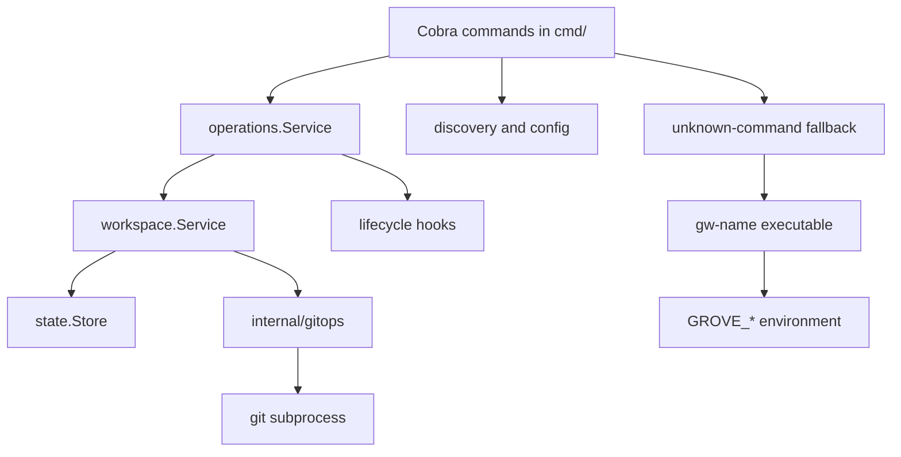
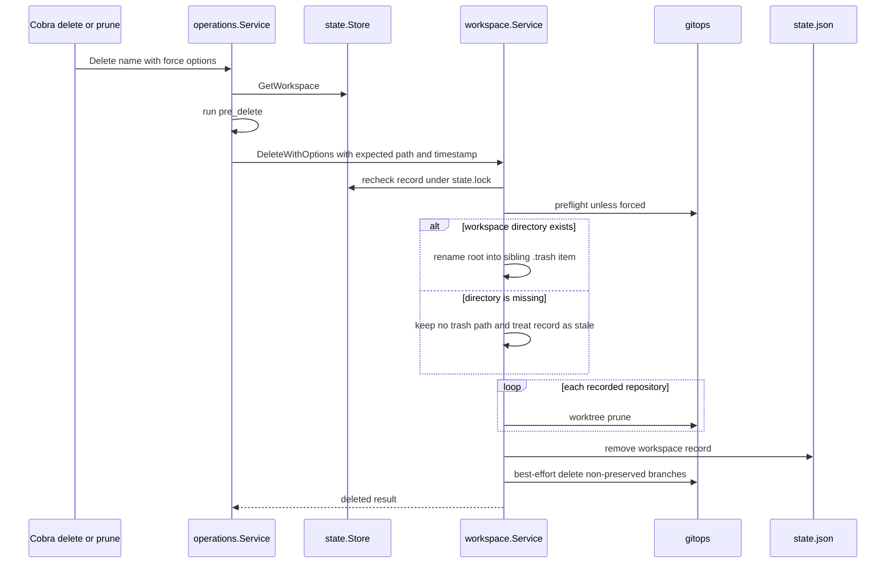
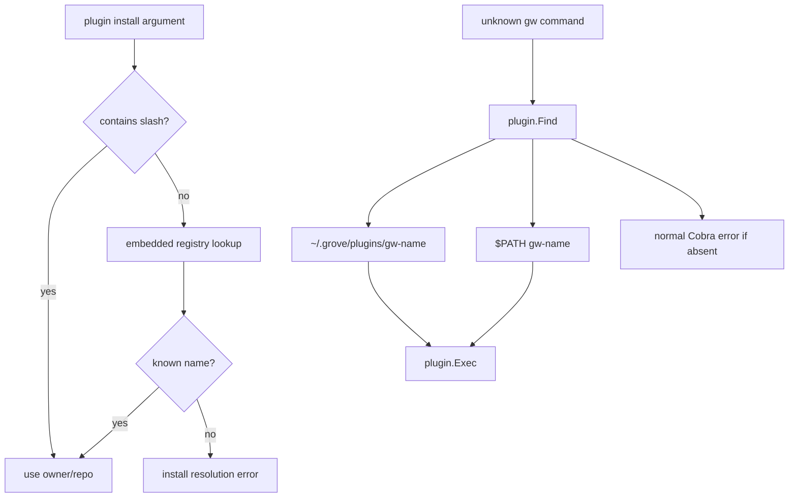

# Architecture

Grove is a local orchestrator for Git worktree workspaces. Cobra commands parse intent and select targets; `internal/operations` applies user-facing lifecycle policy; `internal/workspace` performs workspace mutations; `internal/gitops` is the Git subprocess boundary; and `internal/state` owns durable workspace records. Worktrees, branches, and their registrations remain Git-owned resources, while Grove persists the metadata needed to find and safely manage them.

## Runtime boundaries

This boundary keeps command UX and hook policy out of workspace mechanics, and keeps shell details and Git failure interpretation behind `gitops`.

## CLI and operation orchestration

`cmd.Execute()` runs the Cobra root. The root registers built-in commands including `delete`, `prune`, and `plugin`; its persistent pre-run skips update/logging setup for commands annotated offline and otherwise configures logging and an update notice. Cobra errors are silenced so the root can attempt external-plugin dispatch only for an unknown command.

`operations.Service` is the user-facing ordering boundary. `Create` calls workspace creation, reloads the committed record, then runs `post_create`; a configured aborting hook returns an error but does not roll back the already-created workspace. `Delete` loads the record, runs `pre_delete`, copies its `CreatedAt` and `Path` into the removal request, and then invokes workspace deletion. Missing hooks are non-fatal for these operations; non-aborting hook failures are warnings. The workspace package itself does not own global lifecycle policy.

## Delete and prune call chain

`gw delete NAME...` (or `gw ws delete`) resolves names from arguments, stdin, or an interactive picker, de-duplicates explicit names, and invokes `operations.NewService().Delete` with `workspace.RemoveOptions{Force: true}`. `gw prune` first parses `--min-age` (`h`, `d`, `w`, or a bare number meaning days), loads state, and selects records old enough **or whose directory is missing**. Without `--yes` it only previews; with `--yes` it sends every candidate through the same `operations.Service.Delete` path with force enabled.

The sequence shows the cleanup boundary and its stale-directory branch.

`workspace.DeleteWithOptions` preflights non-forced removals by checking Git registration, recorded branch, current branch, and clean status. It runs per-repository teardown commands before acquiring the mutation lock, then reloads and repeats the expected-record and preflight checks under `state.lock`. If the root exists, it is renamed into a sibling `.trash` item before each source repository receives `git worktree prune`. If the root is already absent, the record is explicitly treated as stale: there is nothing to quarantine, but Git registrations, state, and branches still require cleanup.

The cleanup invariant is: state is removed only after all worktree-prune calls succeed; if pruning or state removal fails after quarantine, Grove restores the root and attempts `git worktree repair`. Only after state removal does it attempt branch deletion, skipping `PreserveBranch` records and treating branch failures as warnings. A successful quarantined deletion schedules best-effort unlink outside `state.lock`; the unlink helper accepts only an item whose immediate parent is `.trash` and retries removal. Thus leftover trash must not keep a workspace record alive, while a failed registration/state phase does not silently destroy the workspace.

## Creation, state, and Git

Workspace creation acquires the state lock, validates repositories, fetches sources concurrently, adds worktrees sequentially, and saves the complete state atomically. A provisioning or save failure rolls back created worktrees in reverse order and deletes only branches created by that operation. Setup commands run after the commit and lock release; they are warnings rather than rollback triggers.

`state.Store.Load` treats a missing or empty `state.json` as an empty workspace list and reports corrupt JSON with a `gw doctor --fix` hint. `Save` writes a temporary sibling and renames it over `state.json`. `RemoveWorkspace` filters the named record and saves the resulting complete list. Mutating workspace operations use the stable sibling `state.lock` through `WithLock`, preventing concurrent processes from losing updates. The store also supports locating the workspace containing a path, which is used when constructing plugin context.

All Git operations pass through `gitops`: commands are non-interactive, capture combined output, and wrap failures with Git-specific context. The wrapper owns worktree registration/prune/repair, branch operations, status, fetch, and synchronization primitives, so workspace orchestration does not shell out directly.

## Hooks, output, and lifecycle

Global hooks are configured shell commands. `lifecycle.Run` expands workspace and optional source variables, supports streamed or captured output, and enforces a duration timeout by killing the hook process group. `--no-hooks` disables the runner. Operation policy decides whether hook absence is acceptable, whether failure aborts, and whether a warning is sufficient. Workspace deletion additionally runs repository-local teardown commands before its lock-protected mutation.

Commands use console output for tables, previews, warnings, and success messages. `prune` supports human-readable output and `--json`; its JSON records include name, branch, creation time, age, and whether the directory is missing. `plugin search` and `plugin list` likewise support JSON output.

## External plugin boundary

Plugins are external executables, not in-process extensions. An unknown `gw foo` is first rejected by Cobra, then `cmd.Execute` extracts `foo`, calls `plugin.Find`, and dispatches only if an executable `gw-foo` is found. `plugin.Find` validates the name and searches `~/.grove/plugins/` first, then `$PATH`; if neither contains the executable, the normal Cobra error is printed. On Unix `plugin.Exec` replaces the current process; on Windows it runs a child and propagates its exit code. The environment includes `GROVE_DIR`, `GROVE_CONFIG`, `GROVE_STATE`, and `GROVE_WORKSPACE` when the current directory is inside a recorded workspace.

The embedded registry is a separate ownership boundary. `internal/plugin/registry.go` embeds and validates `internal/plugin/registry.json`, sorts entries, powers `gw plugin search`, and resolves a bare install name to an `owner/repo`. The built-in registry now contains only `code` and `dispatch`; it is a curated install/catalog source, not an inventory of installed executables and not the dispatch mechanism. `plugin.List` instead scans executable `gw-*` files in `~/.grove/plugins/`, while `plugin.Find` also discovers PATH installations. A bare name absent from the registry fails install resolution with guidance to use `owner/repo` or search; that is distinct from unknown-command fallback, which searches for an installed executable regardless of registry membership.

The diagram distinguishes catalog resolution for installation from installed-executable discovery and unknown-command fallback.

## Focused tests and change map

Use real temporary Git repositories for cleanup and workspace behavior. `internal/workspace/remove_test.go` covers forced, dirty, stale-directory, and branch-cleanup paths; `remove_options_test.go` covers expected-record protection; and `service_unlink_test.go` covers detached trash removal. `internal/operations/service_test.go` checks hook ordering and abort policy. State locking and persistence are covered by `internal/state/state_test.go`. For CLI behavior, the command tests around delete and prune cover name input, age parsing, missing-directory candidates, preview, and JSON output; plugin tests cover registry validation, install resolution, executable discovery, and dispatch. End-to-end fixtures under `e2e/` exercise the compiled `gw` with isolated homes and Git repositories.

| Boundary | Primary sources | Safe change question |
|---|---|---|
| CLI and fallback | `cmd/root.go`, `cmd/delete.go`, `cmd/prune.go`, `cmd/plugin.go` | Is this Cobra input, preview/output, or external dispatch policy? |
| Operation policy | `internal/operations/service.go` | Does the hook run before or after durable mutation, and can it abort? |
| Workspace cleanup | `internal/workspace/remove.go` | Does stale-state handling preserve prune, restore, state, and branch invariants? |
| Durable state | `internal/state/state.go`, `internal/state/lock.go` | Is the complete record updated atomically under the lock? |
| Plugin catalog and execution | `internal/plugin/registry.go`, `internal/plugin/registry.json`, `internal/plugin/plugin.go` | Is registry resolution kept separate from executable discovery and fallback? |
| Git boundary | `internal/gitops` | Are non-interactive execution and worktree registration semantics preserved? |
