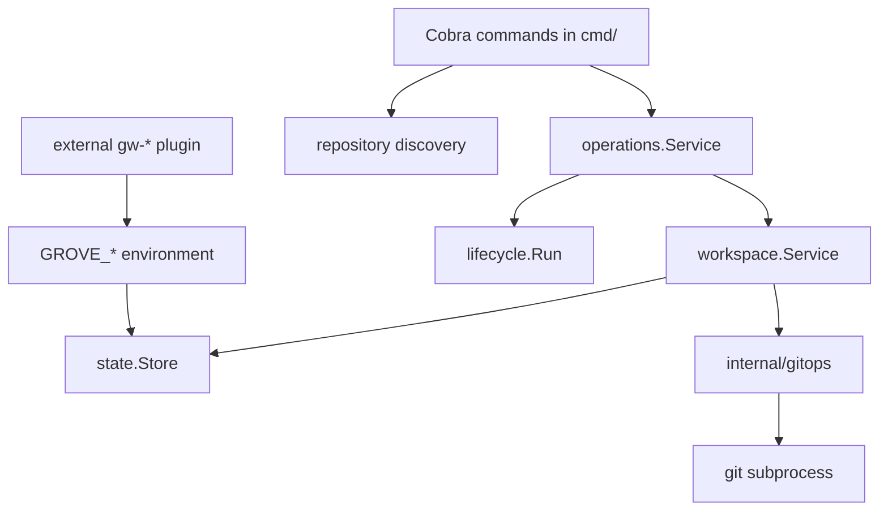
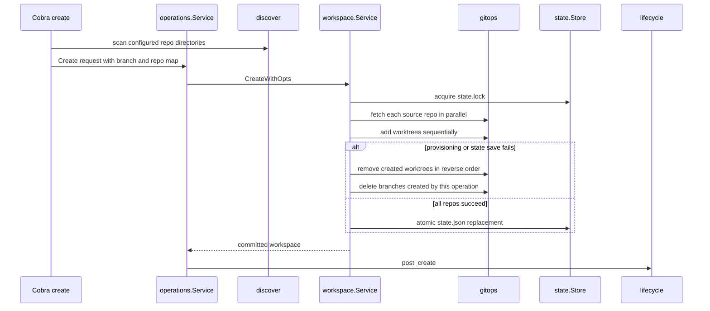
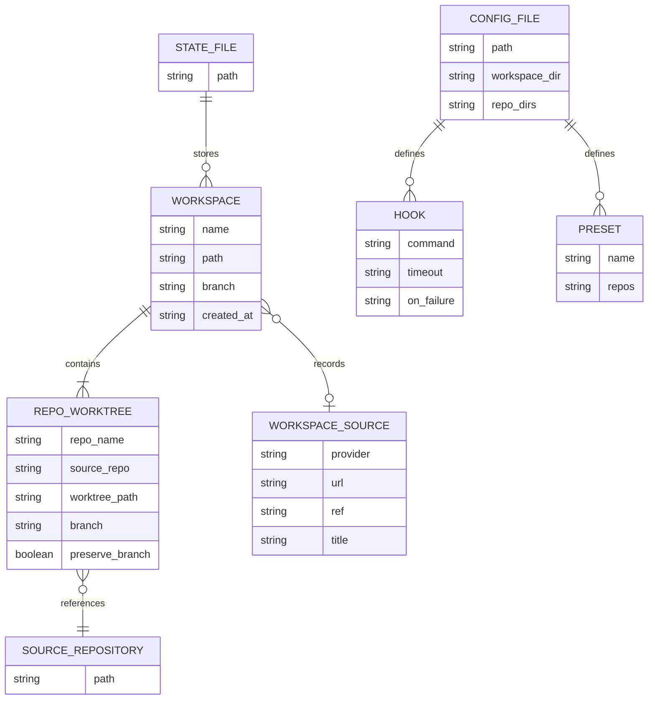
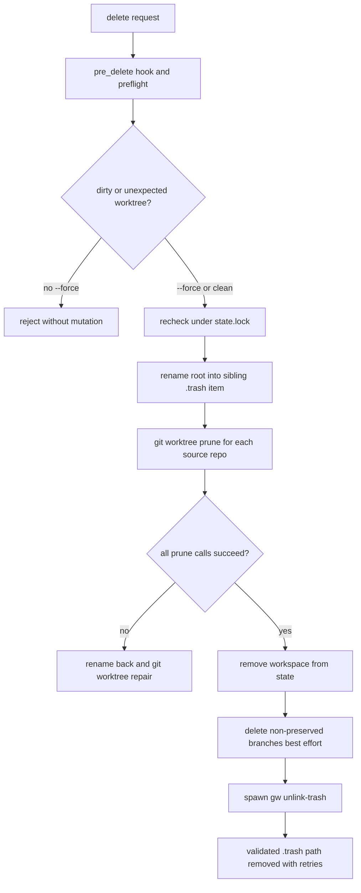

# Architecture

Grove is a local orchestrator for Git worktrees. The CLI resolves user intent and repository identities; `internal/operations` applies user-facing hook policy; `internal/workspace` owns workspace mutations; and `internal/gitops` is the boundary to Git subprocesses. Workspace metadata is durable, but the worktrees and branches remain Git-owned resources.

## Ownership boundaries

This diagram shows the ownership boundary: commands select and validate inputs, operation orchestration orders global hooks, the workspace service changes worktrees and state, and Git is invoked only through the subprocess wrapper.

### CLI and operation orchestration

`cmd/gw/main.go` enters Cobra through `cmd.Execute()`. Commands such as `create`, `delete`, and `sync` load configuration, discover or resolve repositories/workspaces, and delegate rather than implementing worktree mechanics. `cmd/create.go` supports named repos, presets, all discovered repos, interactive selection, remote URL cloning, branch tracking, and optional source provenance. `cmd/sync_cmd.go` resolves a workspace from an explicit name or the current directory before calling `workspace.Service.Sync()`.

The operation service is the user-facing boundary for create/delete hooks. It runs `pre_delete` before destructive work and records expected creation time and path so the locked delete phase can reject a workspace changed after preflight. It runs `post_create` after the workspace has been committed. A missing hook is non-fatal for these operations; a configured hook with `on_failure = "abort"` returns an error, but a failed aborting `post_create` does not roll back an already-created workspace. The workspace package itself is deliberately lifecycle-free.

## Create path and rollback

The create call sequence is intentionally split into slow, parallel network work and sequential mutation:

The diagram shows the create ordering and failure path.

`CreateWithOpts` first rejects an existing name, creates the workspace root, validates every requested repository before provisioning, and fetches all sources concurrently. It then adds worktrees one repository at a time so rollback can remove already-created worktrees in reverse order. A missing remote branch in tracking mode falls back to creating a branch from the resolved base. If worktree creation or state persistence fails, `errors.Join` reports the primary failure together with cleanup failures; only branches created by this operation are deleted. Per-repository `.grove.toml` setup commands run concurrently **after** state is committed and the state lock is released. Setup failures are warnings and do not undo the workspace.

## Persisted model and relationships

This diagram maps the durable workspace record to its per-repository worktrees and optional opaque provenance.

`models.Workspace` stores the workspace name, root, common branch label, creation timestamp, repository records, and optional `WorkspaceSource`. Each `RepoWorktree` records both the source repository and worktree path, plus whether its branch should be preserved during deletion. Global TOML configuration owns repository scan roots, workspace directory, presets, and hooks; per-repository `.grove.toml` owns base branch and setup, sync, run, and teardown commands.

### State and configuration invariants

- `state.Store.Save` serializes the complete workspace slice to `state.json.tmp` and renames it over `state.json`. This is an atomic replacement, but the implementation does not call `fsync`; corruption is reported as an actionable `gw doctor --fix` suggestion.
- `state.Store.WithLock` uses an OS `flock` on the stable sibling `state.lock`. Mutating create and delete operations hold this cross-process lock while rereading, changing Git registrations, and updating state; detached cleanup is deliberately outside the lock.
- `config.Load` returns no config when the file is absent, migrates legacy `repos_dir` to `repo_dirs`, and supplies the default workspace directory. `config.Save` also uses a temporary file plus rename and validates preset names.

## Discovery and Git boundary

Discovery rescans configured directories on every command, walking up to three levels and stopping descent at a repository. Remote URL resolution is batched and parallel, with an on-disk `cache/remotes.json`; repositories sharing a remote are deduplicated, preferring a direct child over a nested clone, and results are sorted by display name. A repository without a remote is deduplicated by resolved path.

All Git commands pass through `gitops.runGit`. It supplies non-interactive authentication settings (`GIT_TERMINAL_PROMPT=0` and batch-mode SSH), redirects stdin to the null device, captures combined output, and wraps failures as `GitError`; authentication-like output gets a credential-oriented hint. The wrapper owns worktree add/remove/prune/repair, branch switching and deletion, status, fetch, base-branch resolution, and rebase operations. This keeps shell details and Git failure interpretation out of workspace orchestration.

## Delete, quarantine, and safe cleanup

The diagram shows quarantine before logical deletion, rollback on registration failure, and cleanup after state removal.

Deletion has two safety layers. Before mutation, every non-forced worktree must still be registered at the recorded path and branch, be on that branch, and have an empty short status; otherwise the operation rejects the request with a commit/stash/`--force` remedy. Under the lock, those checks are repeated, the workspace root is atomically renamed into a sibling `.trash/<name>-<timestamp>`, Git registrations are pruned, and state is removed. If pruning or state removal fails, the root is restored and `git worktree repair` is attempted for each repo; cleanup errors are aggregated. Branch deletion is best effort and skips `PreserveBranch` records.

The detached `gw unlink-trash PATH` process is intentionally narrow: `UnlinkTrashPath` accepts only a path whose immediate parent is `.trash`, retries `RemoveAll`, and logs failure without keeping the state lock. If process creation fails, cleanup falls back to synchronous unlink. `gw doctor` can inspect leftover trash and remove unowned items with `--fix`; a trash item still associated with a live workspace is preserved.

## Concurrency, sync, and reset

Status, sync, reset, discovery remote resolution, fetch during create, and setup hooks use one goroutine per repository (or per repository task) and wait for all tasks. Status writes into indexed result slots, preserving repository order. Sync checks status before rebasing and skips dirty worktrees; it fetches first, resolves `.grove.toml`'s base branch or the remote default, and aborts an in-progress rebase after failure. Its per-repository failures are warnings and the service returns after all workers finish rather than returning an aggregated error.

Reset compares the live branch with the recorded branch. A clean worktree on another branch is switched back; a dirty worktree is skipped unless `--discard`, which passes `git switch --discard-changes`. Each repository then reuses the same sync path. This is a recovery operation, not a state rewrite: the recorded branch in `state.json` remains authoritative.

## Hooks and external plugins

Global lifecycle hooks are shell commands from `[hooks]` in `config.toml`. `lifecycle.Run` expands shell-quoted `{name}`, `{path}`, `{branch}`, and optional source placeholders, supports streamed or captured output, and applies a duration timeout by killing the hook process group. Its `HookError` carries the `on_failure` abort policy. `--no-hooks` disables the runner.

Plugins are not in-process extensions. `plugin.Find` accepts validated names, looks first for executable `gw-<name>` under `~/.grove/plugins/`, then `$PATH`; `plugin.Exec` replaces the current process on Unix (or runs a child on Windows). It passes `GROVE_DIR`, `GROVE_CONFIG`, `GROVE_STATE`, and—when the current directory belongs to one—`GROVE_WORKSPACE`. Hooks and these environment variables are the stable external boundary: plugins interpret provider URLs, dashboards, agents, or terminal behavior; core stores source metadata opaquely and does not embed provider-specific logic.

## Focused change and test map

The architecture is best validated with real temporary Git repositories rather than mocks alone. `internal/workspace/create_test.go` covers provisioning and rollback; `remove_test.go`, `remove_options_test.go`, and `service_unlink_test.go` cover dirty-worktree safeguards, quarantine, repair, and asynchronous cleanup; `sync_test.go` and `reset_test.go` cover dirty skips, branch restoration, discard, and rebase behavior; `status_test.go` checks concurrent status collection; `internal/state/state_test.go` covers persistence; and `internal/operations/service_test.go` covers hook ordering and abort policy. End-to-end fixtures under `e2e/` run the compiled `gw` against isolated homes and Git repositories. Use `just check` for tests and vet, and `just e2e` for the binary-level path.

### Focused source map

| Boundary | Primary sources | Safe change question |
|---|---|---|
| CLI entry and selection | `cmd/gw/main.go`, `cmd/root.go`, `cmd/create.go`, `cmd/delete.go`, `cmd/sync_cmd.go`, `cmd/reset.go` | Is this input, confirmation, or orchestration policy? |
| Operation policy | `internal/operations/service.go` | Does a hook run before or after the durable mutation, and can it abort? |
| Workspace mutation | `internal/workspace/create.go`, `remove.go`, `sync.go`, `reset.go`, `service.go` | Does this preserve rollback, dirty-worktree, and per-repo isolation? |
| Durable state | `internal/state/state.go`, `lock.go`, `internal/models/models.go` | Is the complete record replaced atomically and changed under `state.lock`? |
| Git subprocess boundary | `internal/gitops/gitops.go` | Are non-interactive environment, captured errors, and worktree registration semantics preserved? |
| Discovery and config | `internal/discover/deepdiscover.go`, `internal/config/config.go` | Does this affect identity deduplication, cache behavior, or migration? |
| Hooks and extensions | `internal/lifecycle/lifecycle.go`, `internal/plugin/plugin.go` | Is the behavior still external, shell-quoted, timeout-aware, and safe to invoke? |
