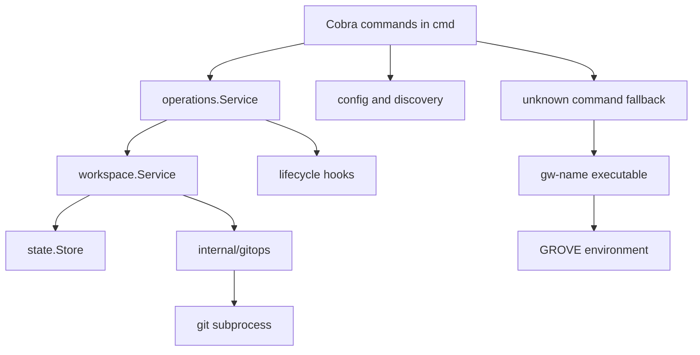
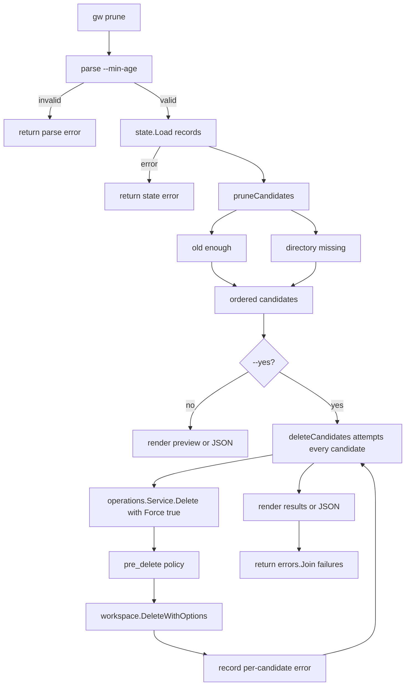
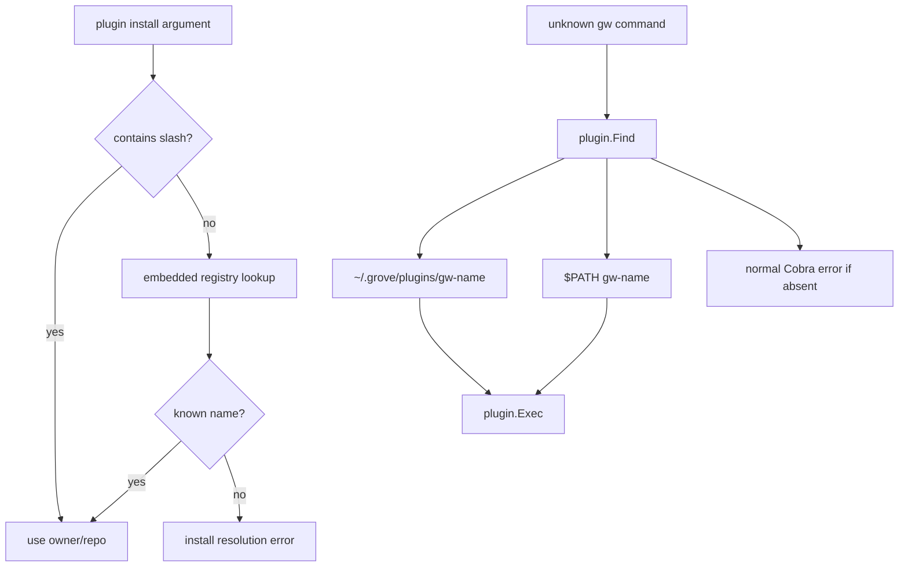

# Architecture

Grove is a local orchestrator for Git worktree workspaces. Cobra commands parse intent and choose targets; `internal/operations` applies user-facing lifecycle policy; `internal/workspace` performs workspace mutations; `internal/gitops` is the Git subprocess boundary; and `internal/state` owns durable workspace records. Git remains authoritative for worktree registrations and branches, while Grove persists the metadata needed to find and safely manage them.

## Runtime boundaries

This boundary keeps command UX and hook policy out of workspace mechanics, and keeps shell details and Git failure interpretation behind `gitops`.

## CLI and operation orchestration

`cmd.Execute()` runs the Cobra root. The root registers built-in commands including `delete`, `prune`, and `plugin`. Its persistent pre-run skips update and logging setup for commands annotated offline and otherwise configures logging and an update notice. Cobra errors are silenced so the root can attempt external-plugin dispatch only for an unknown command.

`operations.Service` is the user-facing ordering boundary. `Create` calls workspace creation, reloads the committed record, then runs `post_create`; an aborting hook returns an error but does not roll back the already-created workspace. `Delete` loads the record, runs `pre_delete`, copies its `CreatedAt` and `Path` into the removal request, and then invokes workspace deletion. Missing hooks are non-fatal for these operations; non-aborting hook failures become warnings, while aborting failures stop the operation. The workspace package itself is lifecycle-free: its teardown commands are repository-local cleanup primitives, not global hook policy.

## Prune control flow

`cmd/prune.go` owns age parsing and candidate selection. `parseMinAge` accepts `h`, `d`, or `w` suffixes and interprets a bare number as days; negative and malformed values are rejected. `runPrune` then calls `state.Load`, and `pruneCandidates` retains records that are at least the requested age old **or whose directory is missing**, preserving state order. An unparseable timestamp is not old by itself, but a missing directory still makes that record a candidate.

The diagram shows why prune is not the old `workspace.OlderThan` path: state loading, age interpretation, missing-directory detection, and result rendering belong to the command. With `--yes`, `deleteCandidates` deliberately attempts every candidate, writes each deletion failure into that candidate's `Error` field, joins the named errors, renders all results first, and only then returns the joined error. Thus a partial cleanup is visible in both human output and JSON and still produces a non-zero command result. Without `--yes`, prune is a preview and performs no deletion.

`gw delete NAME...` and `gw ws delete` resolve names from explicit arguments, newline-delimited stdin, or an interactive picker. Explicit names are de-duplicated. Each selected name is sent to `operations.Service.Delete` with `workspace.RemoveOptions{Force: true}`. Prune uses the same forced service path, but owns batch iteration and failure aggregation rather than stopping at the first failed workspace.

## Workspace deletion and cleanup invariants

`workspace.DeleteWithOptions` first loads the record and verifies any expected `CreatedAt` and `Path` supplied by `operations.Service`. It preflights Git registration, branch, current branch, and clean status only when `Force` is false. Repository-local teardown commands run before the mutation lock; the record is then reloaded and checked again inside `state.lock`.

Inside the lock, an existing workspace root is renamed into a sibling `.trash` item. A missing root is explicitly stale state: there is nothing to quarantine, but recorded Git worktree registrations, Grove state, and branches still require cleanup. Grove calls `git worktree prune` for every recorded source repository. If any prune fails, or state removal fails after quarantine, it restores the root and attempts `git worktree repair`. State is removed only after all worktree-prune calls succeed. Branch deletion happens after state removal, skips `PreserveBranch` records, and is best-effort with warnings.

After a successful quarantined deletion, trash unlink is scheduled outside `state.lock`; if the detached process cannot start, cleanup falls back to synchronous unlink. `UnlinkTrashPath` accepts only a path whose immediate parent is `.trash` and retries removal. Leftover trash therefore does not keep a workspace record alive, while a failed Git or state phase does not silently destroy the workspace.

## Creation, state, configuration, and Git

Workspace creation acquires the state lock, validates repositories, fetches sources concurrently, adds worktrees sequentially, and saves the complete state atomically. A provisioning or save failure rolls back created worktrees in reverse order and deletes only branches created by that operation. Setup commands run after the commit and lock release and are warnings rather than rollback triggers.

`state.Store.Load` treats a missing or empty `state.json` as an empty workspace list and reports corrupt JSON with a `gw doctor --fix` hint. `Save` writes a temporary sibling and renames it over `state.json`; record removal filters the complete list and saves it. `WithLock` uses the stable sibling `state.lock`, so concurrent processes do not lose updates while `state.json` is replaced. The store also locates the workspace containing a path, which is used to construct plugin context.

Configuration is loaded from `~/.grove/config.toml` through `config.Load`; a missing file returns no config, the default workspace directory is filled in, and the legacy `repos_dir` field is migrated to `repo_dirs`. `config.Save` also uses temporary-file replacement. Production workspace services derive their state and statistics stores from `config.GroveDir` and their workspace directory from configuration.

All Git operations pass through `gitops`: commands are non-interactive, use combined output, and wrap failures as `GitError` values with command context. The wrapper owns worktree add, remove, prune, repair, branch operations, status, fetch, and synchronization primitives, so workspace orchestration does not shell out directly.

## Hooks, lifecycle, and output

Global hooks are configured shell commands. `lifecycle.Run` expands workspace and optional source variables, supports streamed or captured output, and enforces a duration timeout by killing the hook process group. `--no-hooks` disables the runner. Operation policy decides whether hook absence is acceptable, whether a failure aborts, and whether a warning is sufficient. Hook output is streamed to stderr when requested; otherwise it is captured and emitted on failure. Workspace deletion additionally runs repository-local teardown commands before its lock-protected mutation.

Commands use console output for tables, previews, warnings, and success messages. `prune` supports human-readable output and `--json`; JSON candidates contain name, branch, creation time, age in days, a `missing` marker, and an `error` field when forced deletion fails. Plugin search and list also support JSON output, including `[]` for an empty result.

## External plugin boundary

Plugins are external executables, not in-process extensions. An unknown `gw foo` is first rejected by Cobra, then `cmd.Execute` extracts `foo`, calls `plugin.Find`, and dispatches only if an executable `gw-foo` is found. `plugin.Find` validates the name and searches `~/.grove/plugins/` first, then `$PATH`; if neither contains the executable, the normal Cobra error is printed. On Unix `plugin.Exec` replaces the current process; on Windows it runs a child and propagates its exit code. The environment includes `GROVE_DIR`, `GROVE_CONFIG`, `GROVE_STATE`, and `GROVE_WORKSPACE` when the current directory is inside a recorded workspace.

The embedded registry is a separate ownership boundary. `internal/plugin/registry.go` embeds and validates `internal/plugin/registry.json`, sorts entries, powers `gw plugin search`, and resolves a bare install name to an `owner/repo`. The built-in registry is a curated install/catalog source, not an inventory of installed executables and not the dispatch mechanism. `plugin.List` scans executable `gw-*` files in `~/.grove/plugins/`, while `plugin.Find` also discovers PATH installations. A name absent from the registry can still be dispatched if a matching executable is installed; install resolution and unknown-command fallback are separate decisions.

The diagram distinguishes catalog resolution for installation from installed-executable discovery and unknown-command fallback.

## Focused tests and change map

Use real temporary Git repositories for cleanup and workspace behavior. `internal/workspace/remove_test.go` covers forced, dirty, stale-directory, and branch-cleanup paths; `remove_options_test.go` covers expected-record protection; and `service_unlink_test.go` covers detached trash removal. `internal/operations/service_test.go` checks hook ordering, authorized identity propagation, and abort policy. State locking and persistence are covered by `internal/state/state_test.go`. `cmd/prune_test.go` covers suffix and bare-number age parsing, age boundaries, missing-directory candidates, malformed timestamps, all-candidate attempts, per-candidate errors, preview, and JSON output. Plugin tests cover registry validation, install resolution, executable discovery, and dispatch. End-to-end fixtures under `e2e/` exercise the compiled `gw` with isolated homes and Git repositories.

| Boundary | Primary sources | Safe change question |
|---|---|---|
| CLI and fallback | `cmd/root.go`, `cmd/delete.go`, `cmd/prune.go`, `cmd/plugin.go` | Is this Cobra input, prune selection, preview/output, or external dispatch policy? |
| Operation policy | `internal/operations/service.go` | Does the hook run before or after durable mutation, and can it abort? |
| Workspace cleanup | `internal/workspace/remove.go`, `internal/workspace/service.go` | Does stale-state handling preserve quarantine, restore, state, and branch invariants? |
| Durable state | `internal/state/state.go`, `internal/state/lock.go` | Is the complete record updated atomically under the lock? |
| Plugin catalog and execution | `internal/plugin/registry.go`, `internal/plugin/registry.json`, `internal/plugin/plugin.go` | Is registry resolution kept separate from executable discovery and fallback? |
| Git boundary | `internal/gitops/gitops.go` | Are non-interactive execution and worktree registration semantics preserved? |
