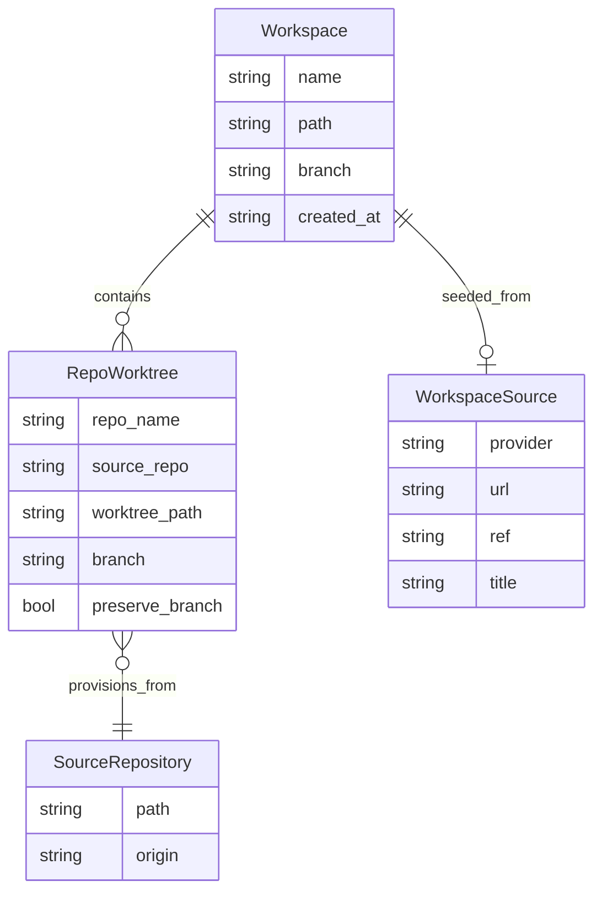
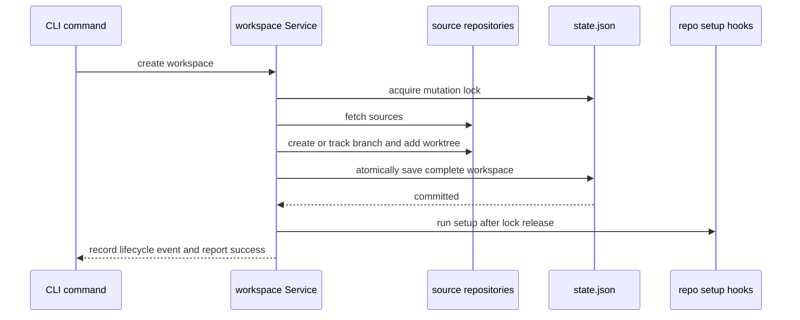

# Core Concepts and Invariants

Grove is a coordinator around independent Git repositories. Its durable model is not “a Git branch across many repositories”: it is a **workspace** containing one worktree record per repository. Git remains authoritative for what is live on disk; Grove state records what it believes it created and where it belongs.

## The domain model

*The persisted relationships between a workspace, its per-repository worktrees, optional provenance, and source repositories.*

`Workspace` has a unique operational name, a root `Path`, a workspace-level `Branch` string, creation timestamp, ordered `Repos`, and optional `Source`. Each `RepoWorktree` identifies the repository by its discovery name, retains the source repository path, and records the expected worktree path and branch. `PreserveBranch` is an ownership flag: removal must not delete that repository branch when it is true. `FindRepo` and `RemoveRepo` address entries by `RepoName`, so repository names are the workspace’s local key.

The workspace branch is a naming convention applied per repository, not a shared Git ref. A workspace may contain the same branch name in each repository, but Git enforces worktree constraints independently in each source repository. A branch already checked out by another worktree in the same source repository makes provisioning fail. A duplicate workspace name is rejected before provisioning; adding a repository already present is an idempotent no-op.

## Recorded branch versus live branch

`RepoWorktree.Branch` is recorded intent and is used for safety checks and cleanup. It is not refreshed automatically. Status reads the current branch from the worktree and displays `(detached)` when Git reports no branch, while separately retaining the recorded branch in state. This distinction matters: a manually switched or detached worktree is drift, not a state update.

Non-forced repository removal validates the live Git worktree registration at the recorded path, checks that its registered branch equals the recorded branch, and rejects dirty worktrees. The command should be repaired, committed, stashed, or explicitly forced rather than silently changing state. Removal deletes the Git worktree first and only removes its state entry after successful cleanup; failed or untouched entries remain recorded.

`preserve_branch` is specifically about branch deletion ownership, not worktree retention. Normal cleanup removes a successfully removed worktree’s branch on a best-effort basis, but skips branch deletion when `PreserveBranch` is true. Rollback likewise deletes only branches created by the failed invocation; a pre-existing branch is preserved even if its newly attempted worktree is rolled back.

## Workspace layout and lifecycle

The configured workspace directory defaults to `~/.grove/workspaces`. Creation makes `<workspace_dir>/<name>/`, then places each worktree at `<workspace path>/<repo name>`. The source repository stays in its configured repository directory; the workspace contains linked Git worktrees, not copies. Creation fetches repositories in parallel, provisions worktrees sequentially for rollback safety, and persists the complete workspace only after provisioning succeeds.

*Creation commits Git and state before running user setup commands.*

If any repository cannot be provisioned, earlier worktrees and branches created by that invocation are rolled back and an empty workspace root is removed. A pre-existing root is not removed. State writes use a temporary file followed by rename; concurrent mutations use the state lock so successful concurrent creations are not lost.

Adding repositories uses the existing workspace branch string and the same worktree layout. It skips names already in the workspace, provisions new entries under the mutation lock, and rolls back earlier additions if a later repository fails. Setup runs after the state mutation and lock release. Removing repositories runs teardown before cleanup, then removes only successful entries, allowing partial failure without erasing evidence of remaining worktrees.

Workspace resolution accepts an explicit name or auto-detects from the current directory. Detection compares canonicalized paths, including symlink resolution, and matches either the workspace root or a descendant. Outside a registered workspace, commands requiring an implicit workspace fail rather than guessing from a source repository.

Renaming changes the workspace name and root path in state and rewrites each recorded worktree path from the old root to the new root. The operation is matched by the old name and persisted as one state replacement; consumers must not treat a rename as a new workspace.

## Branch and base-branch semantics

By default, creation ensures the requested branch exists and creates it from the resolved base. Base resolution is per source repository: `.grove.toml` `base_branch` wins, otherwise the repository’s detected default branch is used as `origin/<branch>`, and failure falls back during creation to `HEAD`. The same resolved base is used by status ahead/behind calculations and sync rebases.

Track mode is an explicit exception for seeding from an existing remote branch, such as a pull-request head. It creates a tracking worktree when the remote branch exists. If it does not exist, Grove safely falls back to creating a fresh branch from base. When a workspace contains multiple repositories, a designated tracked repository gets track mode while sibling repositories with the same branch name still use create mode; PR content must not leak between repositories.

A branch may already exist locally: Grove reuses it rather than claiming it was created, which is why rollback and `preserve_branch` must distinguish ownership. A branch that is already attached to a worktree in the source repository is rejected, even if the requested workspace name is new.

## Discovery identity and deduplication

Configured `repo_dirs` are scanned recursively to depth three. Hidden directories, `node_modules`, and `__pycache__` are skipped; symlink loops are detected. Discovery stops descending into a repository unless explicitly asked to inspect nested repositories.

A discovered `RepoInfo` contains folder `Name`, absolute `Path`, raw `Remote`, and a display name derived as `owner/repo` when the remote parses successfully, otherwise the folder name. Remote identity is the primary deduplication key, not the local path or display name. Multiple paths with the same remote collapse to one result, preferring a direct child of the configured directory over a nested copy. Repositories without a remote deduplicate by resolved filesystem path. Results are sorted by display name and then path, making collisions deterministic.

`UniqueByName` is a separate presentation/workspace-selection rule: it keeps the first sorted repository for each folder name. `RepoMap` likewise keeps the first path for a name. Therefore duplicate folder names are not merged as repositories; they are deterministically shadowed at selection time. Remote lookups are cached in `~/.grove/cache/remotes.json` and cache persistence is best effort.

When adding a remote URL, an existing local directory is acceptable only if its `origin` has the same canonical remote identity. Different URL spellings can therefore identify the same remote, while a same-named directory pointing elsewhere is rejected.

## Presets and configuration ownership

Global configuration lives in `~/.grove/config.toml` and owns repository search roots, workspace directory, presets, and global hooks. `gw init` converts the legacy `repos_dir` field to `repo_dirs`, resolves added directories to absolute paths, rejects missing directories, and deduplicates configured roots.

A preset is only a named list of repository names used to select repos for a workspace; it does not own branches, worktrees, or repository configuration. Preset names must match `[a-zA-Z0-9_-]+`. Adding a preset can take comma-separated names or interactive discovery; list/show/remove operate on the stored map. A preset can become stale if discovery names change, so creation still resolves every selected name through the current repository map.

Per-repository behavior belongs in `.grove.toml`, read from the source repository and cached for the process. `base_branch` controls base resolution. `setup` and `run` accept either one TOML string or a list of strings, normalized to a command slice; non-string list items and other types are configuration errors. `pre_run`, `post_run`, `pre_sync`, `post_sync`, and `teardown` are repository-owned lifecycle commands. Setup runs after create/add commit; teardown runs before removal; sync hooks surround a rebase. Hook failures and execution policy are operation-specific, but repository configuration is never copied into global state.

## Provenance is opaque

`WorkspaceSource` stores `Provider`, `URL`, optional `Ref`, and optional `Title` describing the external seed (for example a GitHub pull request, GitLab merge request, Notion page, or Slack thread). Grove core persists and displays these fields but does not interpret or resolve them. Plugins or integrations resolve external references and pass the resulting branch/repository selection into creation. A source link therefore cannot be used as a substitute for the recorded repository paths and branches.

## Persisted state and lifecycle events

`state.json` contains an array of workspaces. Missing or empty state loads as an empty collection; malformed JSON is an actionable corrupt-state error. Saves create the parent directory and atomically replace the file. State lookup is by workspace name or canonical path containment, and update-by-name supports atomic renames.

`stats.json` is separate usage history, not authoritative workspace state. Successful create and delete operations append `workspace_created` and `workspace_deleted` events containing timestamp, workspace name, workspace branch, repository names, and count. Corrupt stats are treated as resettable history, unlike corrupt state. Event recording happens after creation’s state commit and is observational: it must not redefine workspace identity or repair Git drift.

The key invariant is bidirectional consistency at mutation boundaries: every persisted `RepoWorktree` should correspond to its recorded source repository, registered worktree path, and expected branch; every successful cleanup must remove the corresponding state entry. When that relationship is broken by manual Git changes or interrupted operations, status/doctor and safe preflight should expose the mismatch rather than silently rewriting the model.

## Focused tests that protect the model

- `internal/workspace/create_test.go` covers duplicate workspace names, duplicate branches within a source repository, branch auto-creation, tracking and fallback, designated-repository track mode, rollback ownership, concurrent state preservation, and opaque source persistence.
- `internal/workspace/repos_test.go` covers idempotent additions, rollback of earlier additions, preservation of pre-existing branches, dirty-removal refusal, partial removal, and teardown ordering.
- `internal/gitops/gitops_test.go` exercises base-branch configuration and `.grove.toml` parsing.
- `e2e/repositories_test.go` verifies discovery output, remote URL additions and identity checks, cwd workspace resolution, tracking provenance, and add/remove behavior through the CLI.
- `internal/state/state.go` and `internal/discover/deepdiscover.go` are the ownership points for persistence and discovery invariants; changes to either should be accompanied by tests for atomicity, canonical paths, collisions, and deduplication.
