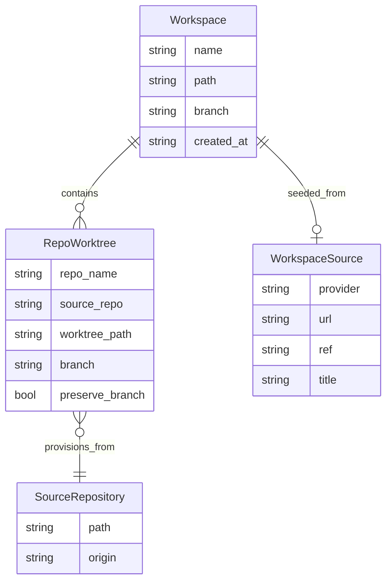
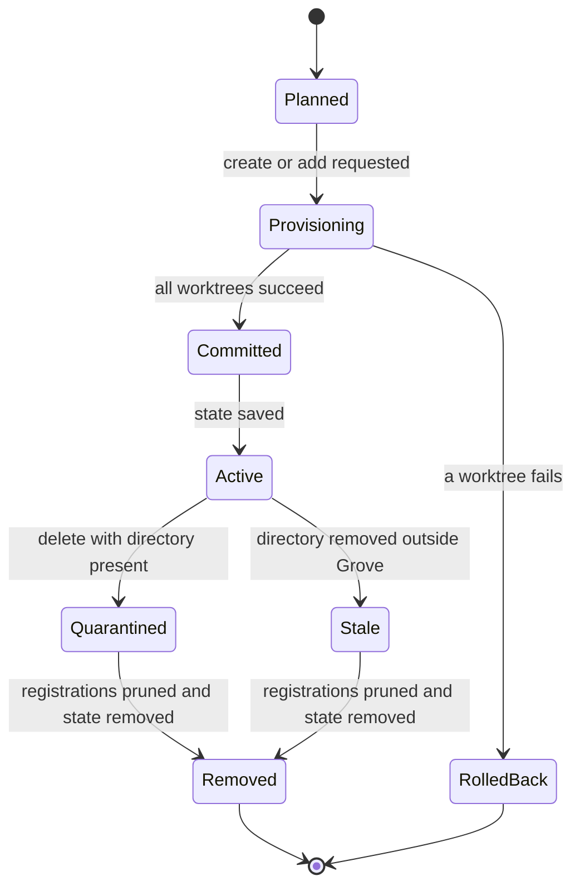
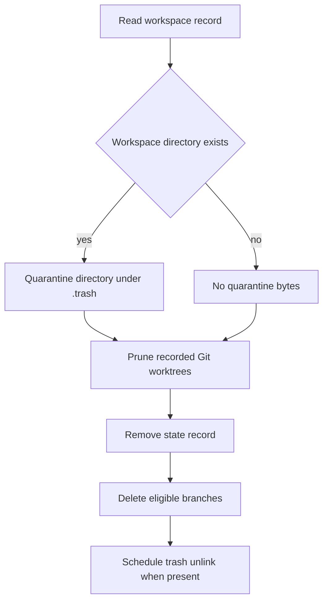

# Domain Concepts

Grove coordinates independent Git repositories. Its durable model is not “one Git branch across many repositories”: a **workspace** is a named collection with one recorded worktree entry per repository. Git is authoritative for registrations and live checkout state; Grove state records what it created, where it belongs, and which branch it expects.

## Workspace and repository worktree model

*The persisted relationships between a workspace, its per-repository worktrees, optional provenance, and source repositories.*

`Workspace` contains a unique operational `Name`, root `Path`, workspace-level `Branch` string, `CreatedAt` timestamp, ordered `Repos`, and optional `Source`. A `RepoWorktree` identifies a repository by its discovery name, retains the source repository path, and records the expected worktree path and branch. `FindRepo` and `RemoveRepo` use `RepoName` as the workspace-local key; duplicate repository names are therefore not a second identity.

The workspace branch is a naming convention applied independently in each source repository, not a shared Git ref. A branch already attached to another worktree in the same source repository blocks provisioning. An existing local branch may be reused, so cleanup must distinguish branches Grove created from pre-existing branches. A duplicate workspace name is rejected before provisioning, while adding a repository already present is an idempotent no-op.

`PreserveBranch` controls branch-deletion ownership, not worktree retention. Successful removal deletes the Git worktree registration and then attempts to delete the branch unless this flag is true. Branch deletion is best effort and a failure is reported without undoing the completed state removal. Rollback deletes only branches created by the failed invocation; it does not delete a pre-existing branch merely because its attempted worktree was rolled back.

## Recorded state versus live Git state

`RepoWorktree.Branch` is recorded intent used for safety checks and cleanup; it is not refreshed automatically. Status reads the current branch from the worktree and displays `(detached)` when Git reports no branch, while retaining the recorded branch in state. A manually switched or detached worktree is drift, not an implicit state update.

Safe, non-forced removal validates that the recorded path is still registered in the source repository, that its registered branch and live current branch equal the recorded branch, and that the worktree is clean. It refuses a missing registration, branch mismatch, or dirty worktree. `--force` bypasses these preflight checks, but does not change the meaning of the recorded fields.

## Creation, mutation, and lifecycle

The configured workspace directory defaults to `~/.grove/workspaces`. Creation makes `<workspace_dir>/<name>/` and places each linked worktree at `<workspace path>/<repo name>`; source repositories remain in their configured locations. Repositories are fetched in parallel, worktrees are provisioned sequentially for rollback safety, and the complete workspace is persisted only after provisioning succeeds.

*Workspace lifecycle states are the observable cleanup phases represented by creation, deletion, rollback, and stale-record handling; `Quarantined` and `Stale` are cleanup conditions rather than persisted enum values.*

If provisioning fails, earlier worktrees and branches created by that invocation are rolled back and an empty workspace root is removed; a pre-existing root is not removed. State writes use a temporary file followed by rename. Mutating services use the state lock around the commit so concurrent successful mutations are not lost. Add operations reuse the workspace branch, skip existing repository names, and roll back earlier additions when a later one fails. Setup hooks run after the state mutation and lock release; teardown runs before deletion cleanup.

Normal deletion runs teardown commands, then quarantines an existing workspace root by renaming it under `.trash`. It prunes each source repository’s Git worktree registration, removes the state record, and schedules best-effort trash unlinking. If pruning or state removal fails, a quarantined directory is restored where possible and the state remains evidence of incomplete cleanup. Branch deletion follows successful cleanup and honors `PreserveBranch`.

### Missing paths and stale records

A workspace directory can disappear outside Grove while its source repositories still retain Git worktree registrations and its `state.json` record still lists the worktrees and eligible branches. This is a distinct stale-record condition, not proof that cleanup is complete.

For a missing directory, deletion intentionally has **no quarantine bytes**: there is nothing to rename into `.trash`. It still prunes every recorded Git worktree registration, removes the state record, and attempts the eligible branch cleanup. This ordering preserves the invariant that missing on-disk bytes do not excuse cleanup of Git metadata, durable state, or branch ownership.

*Deletion uses the same registration, state, and branch cleanup obligations for a normal workspace and a stale record; only quarantine is skipped when the directory is missing.*

## Timestamps and prune candidates

`NewWorkspace` writes `created_at` as a local wall-clock timestamp in `2006-01-02T15:04:05.000000` form. Readers parse that six-fractional-digit format in the current location and accept the older second-precision `2006-01-02T15:04:05` form as a compatibility fallback. Invalid or missing timestamps are not old candidates.

`gw prune` parses `--min-age` as a duration: `h` means hours, `d` means days, and `w` means seven days. A bare non-negative number retains the original day semantics, so `14` means fourteen days. Empty, negative, malformed, or unsupported-unit values are rejected. A workspace is age-eligible when its parsed creation time is at least the minimum age before `now`; `age_days` is the whole elapsed-day count used in previews.

A missing workspace directory makes its record eligible independently of age, even when its timestamp is fresh or unparsable. Candidate output preserves state order and includes `missing: true` in JSON for that record. Preview mode only reports candidates; `--yes` deletes each candidate through the same forced cleanup path used for workspace deletion.

## Persisted state and lifecycle metadata

`state.json` is an array of workspaces. A missing or empty file loads as an empty collection; malformed JSON is an actionable corrupt-state error. Saves create the parent directory, write a temporary file, and atomically rename it into place. Lookup is by workspace name or canonical path containment, including symlink resolution. Rename replaces one state entry and rewrites each recorded worktree path from the old root to the new root; it is not a new workspace identity.

State is authoritative for Grove’s intended workspace membership, but not for live Git drift. At mutation boundaries, each persisted worktree should correspond to its source repository, registered path, and expected branch, and successful cleanup must remove the corresponding state entry. Status and doctor should expose broken relationships rather than silently rewriting them.

`stats.json` is separate observational usage history, not workspace state. Successful create and delete operations append lifecycle events containing timestamp, workspace name, branch, repository names, and count. Stats corruption is resettable history, unlike corrupt `state.json`; recording an event after a state commit must not redefine identity or repair Git drift.

## Plugin identity and extension boundary

Plugins are external executables named `gw-<name>`. Lookup checks `~/.grove/plugins/` before `$PATH`; installed-directory listing includes executable `gw-` files there, while manually placed binaries may have no installation metadata. The plugin environment receives `GROVE_DIR`, `GROVE_CONFIG`, `GROVE_STATE`, and—when the current directory resolves inside a registered workspace—`GROVE_WORKSPACE`.

The embedded curated built-in registry has exactly two entries: `code` (`igor-kupczynski/gw-code`) and `dispatch` (`nicksenap/gw-dispatch`). Registry search is only a catalog of known plugins; it is not the complete installed-plugin set. `gw plugin list` discovers executable files in the plugins directory, and `$PATH` plugins are also valid for command lookup without appearing in that directory listing.

Installation accepts a bare name only when it resolves through that registry, but an argument containing `/` is treated as an owner/repository reference. Thus arbitrary repositories remain installable with `owner/repo` (or a GitHub URL), even when they are not curated registry entries. Release metadata records the source repository and version for upgrades; manually installed binaries without metadata are skipped by bulk upgrade. Plugin names are validated before lookup or installation.

## Provenance and configuration ownership

`WorkspaceSource` stores `Provider`, `URL`, optional `Ref`, and optional `Title` describing an external seed such as a GitHub pull request, GitLab merge request, Notion page, or Slack thread. Core persists and displays these fields but does not interpret or resolve them; plugins and integrations resolve external references and pass repository and branch selection into workspace creation. Provenance cannot substitute for recorded repository paths and branches.

Global `~/.grove/config.toml` owns repository search roots, workspace directory, presets, and global hooks. A preset is only a named list of repository names used for selection; it does not own branches, worktrees, or repository configuration. Per-repository `.grove.toml` owns base-branch selection and repository lifecycle commands. Configuration is not copied into workspace state.

## Focused tests that protect the model

- `cmd/prune_test.go` covers duration units, bare-number day compatibility, age reporting, missing-directory candidates, JSON output, and invalid values.
- `internal/workspace/remove_test.go` verifies that a missing workspace directory still prunes Git registrations and removes state without creating quarantine content; related tests cover teardown and partial failure.
- `internal/workspace/create_test.go` covers duplicate names, branch conflicts, tracking fallback, rollback ownership, concurrent state preservation, and opaque source persistence.
- `internal/state/state.go` is the persistence ownership point for empty/malformed loads, atomic saves, path resolution, and rename replacement.
- `internal/plugin/registry_test.go` verifies registry validation, search, and the distinction between bare-name resolution and arbitrary `owner/repo` installation; `internal/plugin/install_test.go` covers installation metadata and upgrade behavior.
