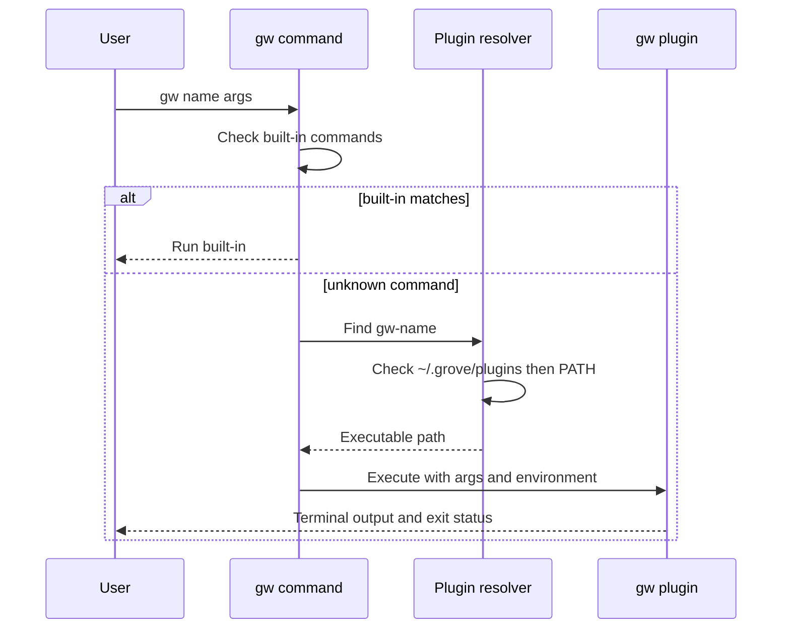
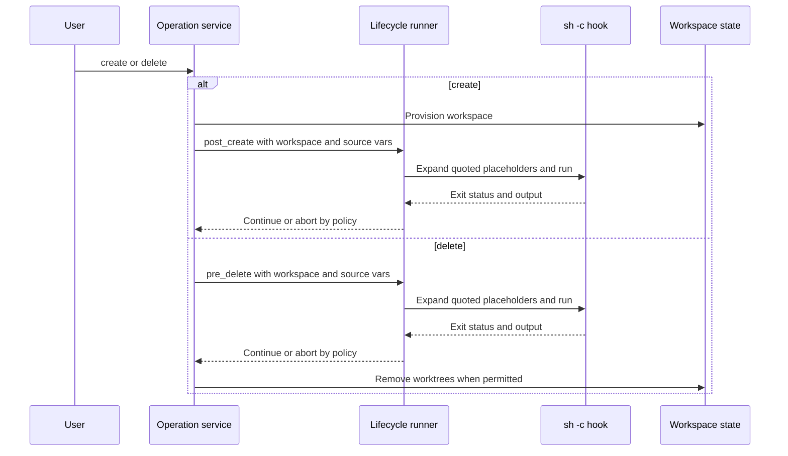

# Integrations

Grove owns workspace and Git-worktree state. External tools integrate through the plugin command boundary, global lifecycle hooks, and the per-repository `.grove.toml` contract; plugins do not receive a Grove mutation API. A plugin may read the state and configuration paths Grove supplies, but should use Grove commands rather than editing Grove-owned state files directly.

## External plugin contract

A plugin is an executable named `gw-<name>`. `gw <name> ...` first resolves registered built-in commands. Only an unknown command is offered to plugin fallback, so a built-in command takes precedence over a same-named plugin. Fallback searches the user plugin directory first and then `$PATH`:

1. `~/.grove/plugins/gw-<name>`
2. `gw-<name>` resolved through `$PATH`

The selected executable takes control of the terminal and receives the arguments following the plugin name. On Unix Grove replaces its process with the plugin; on Windows it starts a child and propagates the child's exit code. Plugin names must begin with an alphanumeric character and may contain alphanumerics, `-`, `_`, and `.`.



*The dispatch flow shows that plugin execution is process-based; it does not imply a plugin API for mutating Grove state.*

Grove adds these environment variables while preserving the rest of the invoking environment:

| Variable | Meaning |
|---|---|
| `GROVE_DIR` | Grove configuration directory, normally `~/.grove` |
| `GROVE_CONFIG` | Path to `config.toml` |
| `GROVE_STATE` | Path to `state.json` |
| `GROVE_WORKSPACE` | Detected workspace name when the current directory is inside a workspace; otherwise it is not added |

Use `gw plugin list` (or `--json`) to inspect plugins installed in the user plugin directory. `gw plugin remove <name>` removes that directory's executable and its installer metadata; it does not remove arbitrary `$PATH` executables.

## Installing and upgrading released plugins

Install from a GitHub repository using an `OWNER/REPOSITORY` identifier (the full `github.com/OWNER/REPOSITORY` form is also accepted):

```bash
gw plugin install nicksenap/gw-run
gw plugin install nicksenap/gw-dispatch
gw plugin install igor-kupczynski/gw-code
```

The installer discovers the latest GitHub release, selects an archive matching the current OS and architecture, requires an HTTPS asset URL, downloads and extracts the `gw-<name>` binary into `~/.grove/plugins/`, and records the repository and release tag in adjacent metadata. If a release exposes `checksums.txt`, the installer uses it to verify the download. Public releases need no token; `GITHUB_TOKEN` is used for GitHub API and checksum requests when set. A missing compatible archive is an installation error.

`gw plugin upgrade <name>` re-fetches the latest release using recorded metadata. Bare executables copied into the plugin directory have no installer metadata and are skipped by `gw plugin upgrade` without an argument; reinstall them from their repository to make them upgradeable. Released plugins should publish archives using the naming convention supported by the installer.

For a local plugin, install an executable directly:

```bash
cp my-plugin ~/.grove/plugins/gw-myplugin
chmod +x ~/.grove/plugins/gw-myplugin
```

See [Plugin documentation](../docs/plugins.md) for the command reference and authoring checklist.

## Documented external examples

These are integrations, not Grove core commands:

- [`gw-run`](https://github.com/nicksenap/gw-run) supervises per-repository `run` hooks across a workspace and prefixes output with the repository name. Install it before using `gw run`.
- [`gw-dispatch`](https://github.com/nicksenap/gw-dispatch) creates a workspace and starts a selected coding-agent command with an initial prompt. It is agent-agnostic and can use built-in or user-defined agent commands.

  ```bash
  gw plugin install nicksenap/gw-dispatch
  gw dispatch -n -r api,web -P "Implement login"
  gw dispatch -b feat/login -p backend --agent pi -P "Implement login"
  ```

- [`gw-code`](https://github.com/igor-kupczynski/gw-code) generates a multi-folder editor workspace and opens it in VS Code; its configuration can select another compatible editor executable.

  ```bash
  gw plugin install igor-kupczynski/gw-code
  gw code my-workspace
  gw code my-workspace --refresh
  gw code my-workspace --path
  ```

- [`gw-recipe`](https://github.com/nicksenap/gw-recipe) is the external plugin for declarative multi-repository recipes. Recipe validation and recipe-based creation are not core Grove surfaces; follow [the plugin documentation](../docs/plugins.md) for this plugin.

Coding-agent instructions remain repository-owned: put repository-specific guidance in `AGENTS.md`, and put reusable review, testing, or release workflows in agent skills or an equivalent agent extension mechanism. Grove does not prescribe an agent, editor, notification service, or storage format.

## Global lifecycle hooks

Global hooks are configured in `~/.grove/config.toml` under `[hooks]`. The supported workspace-level events are:

| Hook | Timing | Typical integration |
|---|---|---|
| `post_create` | After workspace creation | Install dependencies, prepare ignored files, publish session metadata |
| `pre_delete` | Before worktree removal | Revoke temporary resources or notify an external service |
| `on_close` | From `gw go -c` when closing a terminal pane | Close a multiplexer pane or external session |

A hook can be a command string or a table with metadata:

```toml
[hooks]
post_create = "./scripts/workspace-created {path} {name}"
pre_delete = "./scripts/workspace-closing {path} {name}"
on_close = "tmux kill-pane"

[hooks.post_create]
command = "npm install && npm run build"
description = "Install dependencies and build assets"
stream = true
timeout = "5m"
on_failure = "abort"
```

Hook commands run through `sh -c`. Supported placeholders are `{name}`, `{path}`, `{branch}`, `{source_url}`, `{source_ref}`, and `{source_title}`. Non-empty values are single-quoted, including embedded single quotes escaped for the shell; empty values expand to an empty string. This quoting applies to paths, branch names, and provenance values, preventing a value such as `feat/x; rm -rf ~` from becoming a second command.

`stream = true` sends live, line-prefixed output to stderr. By default output is captured quietly and echoed with the hook-name prefix only when the hook fails. Keeping hook output on stderr preserves stdout for shell integrations such as `cd "$(gw go my-feature)"`. A valid positive Go duration imposes a timeout; on supported macOS and Linux builds Grove kills the hook's process group, including child processes. An invalid duration is warned about and ignored.

The default failure policy is `warn`: the operation continues after a hook failure. `on_failure = "abort"` makes the failure fatal to the operation. Creation is not rolled back if an aborting `post_create` hook fails, because the workspace has already been provisioned. `pre_delete` runs before destructive removal, so an aborting failure prevents that removal. `--no-hooks` (or `-n`) disables all global hooks for that invocation; per-repository hooks are unaffected.



*The lifecycle flow highlights ordering and failure policy; hooks are shell commands around Grove operations, not state-mutating plugin callbacks.*

For the complete hook table, metadata fields, and per-repository behavior, see [Hooks](../docs/hooks.md). That contract also includes per-repo `.grove.toml` keys such as `setup`, `teardown`, `pre_sync`, `post_sync`, `pre_run`, `run`, and `post_run`. Per-repo hook failures are warnings and do not block the attached operation. `pre_run`, `run`, and `post_run` are consumed by the external `gw-run` plugin rather than supervised by Grove core.

## Source provenance

A workspace may carry an optional `source` object in `state.json`:

```bash
gw create my-feature -b feat/login -r svc-a,svc-b \
  --source-url "https://github.com/org/repo/pull/42" \
  --source-provider github \
  --source-ref "42" \
  --source-title "Add login flow"
```

The object records `provider`, `url`, `ref`, and `title`. Grove stores and displays these fields but treats their meaning as opaque; it does not resolve GitHub, GitLab, Notion, Slack, or any other provider. Provider-specific resolution belongs in an external plugin. When a lifecycle hook runs, Grove passes URL, ref, and title through `{source_url}`, `{source_ref}`, and `{source_title}`. There is no `{source_provider}` placeholder. Missing source fields are empty, and an absent source object remains absent in state.

## Shell integration

`gw shell-init` prints a shell wrapper rather than changing the parent shell itself:

```bash
eval "$(gw shell-init)"
gw shell-init --shell nu | save -f ~/.config/nushell/grove.nu
```

The bash/zsh wrapper delegates to `command gw`, so it avoids recursively calling itself. For `gw go`, it changes directory when successful output names an existing directory; otherwise it prints the command output. For `gw create`, it supplies `GROVE_CD_FILE` and changes directory to the path Grove writes there. The Nushell wrapper provides the same `go` and `create` behavior with Nushell environment semantics. Hook output remains on stderr so it cannot corrupt the path captured by these wrappers.

## Troubleshooting and safe extension

- If a plugin is not found, verify the exact `gw-<name>` filename, executable bit, `~/.grove/plugins/`, and `$PATH`; built-in command names cannot be overridden by plugins.
- If a GitHub installation fails, check the repository identifier, latest release, compatible OS/architecture archive, HTTPS asset URL, and optional `GITHUB_TOKEN` for API access.
- If a hook does not fire, check `~/.grove/config.toml`, whether `--no-hooks` was supplied, and run with `--verbose`. For a failing quiet hook, inspect the prefixed stderr output; use `stream` for live progress and `timeout` for bounded external work.
- Keep plugin-specific state outside Grove's state ownership boundary, use the supplied environment paths, quote or accept placeholders as documented, and test against real Git worktrees.

Focused coverage includes end-to-end plugin discovery, argument forwarding, environment propagation, and removal in `e2e/plugin_test.go`; lifecycle placeholder quoting, stream/capture behavior, timeout process-group handling, and failure policy in `internal/lifecycle/lifecycle_test.go`; and source-placeholder and `--no-hooks` behavior in `e2e/lifecycle_test.go`.
