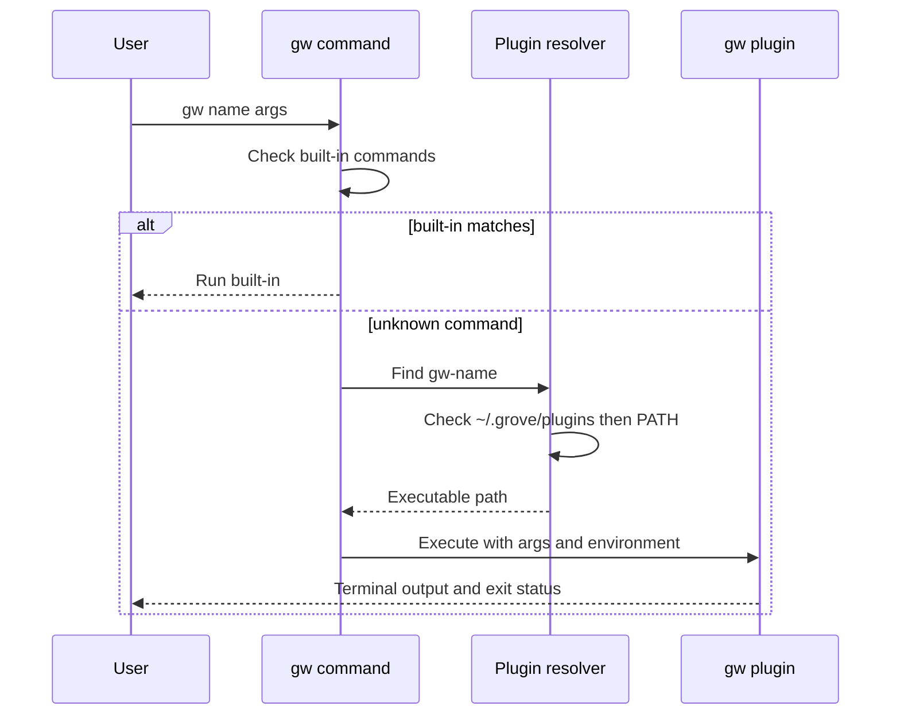
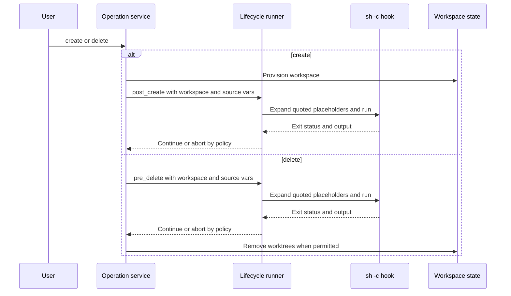

# Integrations

Grove owns workspace records and the Git worktrees represented by them. Integration boundaries are deliberately process- and file-based: external plugins are executables, lifecycle hooks are shell commands, `.grove.toml` supplies per-repository hooks, and shell wrappers consume carefully reserved output. Plugins can read the paths Grove supplies, but should use Grove commands rather than editing Grove-owned state files directly.

## External plugin contract

A plugin is an executable named `gw-<name>`. Built-in Cobra commands are resolved first. Only an unknown command reaches plugin fallback, so a plugin cannot override a built-in command with the same name. Fallback searches the user plugin directory first and then `$PATH`:

1. `~/.grove/plugins/gw-<name>`
2. `gw-<name>` resolved through `$PATH`

The selected executable receives the arguments following the plugin name and takes over the terminal. On Unix Grove replaces its process with the plugin; on Windows it starts a child and propagates the child's exit code. Plugin names must begin with an alphanumeric character and may contain alphanumerics, `-`, `_`, and `.`.



*This sequence shows process dispatch and fallback; it is not a plugin API for mutating Grove state.*

Grove preserves the invoking environment and adds:

| Variable | Meaning |
|---|---|
| `GROVE_DIR` | Grove configuration directory, normally `~/.grove` |
| `GROVE_CONFIG` | Path to `config.toml` |
| `GROVE_STATE` | Path to `state.json` |
| `GROVE_WORKSPACE` | Detected workspace name when the current directory is inside a workspace; otherwise it is not added |

`gw plugin list` (or `--json`) reports executable plugins in the user plugin directory only. `gw plugin remove <name>` removes that directory's executable and its installer metadata; it does not remove an arbitrary `$PATH` executable.

## Curated registry versus executable discovery

The embedded registry is a curated install-name lookup, not the discovery mechanism used to run commands. The current registry contains only these built-in names:

| Registry name | Repository mapping |
|---|---|
| `code` | `igor-kupczynski/gw-code` |
| `dispatch` | `nicksenap/gw-dispatch` |

`gw plugin search [term]` searches this embedded registry by name, repository, or description and is offline. A bare `gw plugin install code` or `gw plugin install dispatch` resolves through the registry. This list is shipped with the `gw` build and can be stale relative to a repository's releases.

An argument containing `/` bypasses registry lookup and is treated as an arbitrary repository reference. Thus `gw plugin install nicksenap/gw-run`, `gw plugin install nicksenap/gw-recipe`, and `gw plugin install github.com/OWNER/REPOSITORY` are valid external installation paths even though those projects are not registry names. Installing a repository and discovering an executable are separate concerns: after installation Grove looks for `gw-<name>` in `~/.grove/plugins/`, then `$PATH`, while manual plugins can be placed in either location.

## Installing and upgrading released plugins

Install from a GitHub repository using an `OWNER/REPOSITORY` identifier; the full `github.com/OWNER/REPOSITORY` form is also accepted:

```bash
gw plugin install nicksenap/gw-run
gw plugin install nicksenap/gw-dispatch
gw plugin install igor-kupczynski/gw-code
```

The installer discovers the latest release, first trying the conventional public GoReleaser release URL and then the GitHub API, selects an archive matching the current OS and architecture, requires an HTTPS asset URL, downloads and extracts the `gw-<name>` binary into `~/.grove/plugins/`, and records the repository and release tag in adjacent metadata. If `checksums.txt` is available, it is used to verify the download. Public releases need no token; `GITHUB_TOKEN` is used for API requests when set. A compatible archive is required.

`gw plugin upgrade <name>` re-fetches the latest release using recorded metadata. `gw plugin upgrade` skips manually copied executables because they have no installer metadata. `gw plugin remove` also removes the adjacent metadata. Released plugins should publish archives using the `gw-<name>_<version>_<os>_<arch>.tar.gz` convention supported by the installer.

For a local plugin, install an executable directly:

```bash
cp my-plugin ~/.grove/plugins/gw-myplugin
chmod +x ~/.grove/plugins/gw-myplugin
```

See [Plugin documentation](../docs/plugins.md) for the command reference and authoring checklist.

## Integration examples and extension boundary

These are external integrations, not Grove core commands:

- [`gw-run`](https://github.com/nicksenap/gw-run) supervises per-repository `run` hooks across a workspace and prefixes output with the repository name. Install it before using `gw run`.
- [`gw-dispatch`](https://github.com/nicksenap/gw-dispatch) creates a workspace and starts a selected coding-agent command with an initial prompt. It is agent-agnostic and can use built-in or user-defined agent commands.
- [`gw-code`](https://github.com/igor-kupczynski/gw-code) generates a multi-folder editor workspace and opens it in VS Code; its configuration can select another compatible editor executable.
- [`gw-recipe`](https://github.com/nicksenap/gw-recipe) is an external plugin for declarative multi-repository recipes. Recipe validation and recipe-based creation are not core Grove surfaces.

```bash
gw plugin install nicksenap/gw-dispatch
gw dispatch -n -r api,web -P "Implement login"
gw dispatch -b feat/login -p backend --agent pi -P "Implement login"
```

Coding-agent instructions remain repository-owned: put repository-specific guidance in `AGENTS.md`, and put reusable review, testing, or release workflows in agent skills or an equivalent agent extension mechanism. Grove does not prescribe an agent, editor, notification service, or plugin storage format.

## Git worktrees and lifecycle ordering

Workspace creation fetches configured repositories in parallel, then creates worktrees sequentially so partially provisioned workspaces can be rolled back. It creates or reuses a local branch, can track an existing remote branch with `--track`, and records the resulting worktree paths in state. A failed provisioning step rolls back already-created worktrees and branches.

Deletion runs global `pre_delete` policy before destructive worktree cleanup. The workspace directory is quarantined into `.trash` when present; each source repository's worktree registration is pruned, state is removed, and created branches are deleted. If cleanup fails, Grove attempts to restore the quarantined directory and repair registrations. A missing workspace directory is treated as a stale state record: there is no directory to quarantine, but worktree registrations, state, and branches are still cleaned up.

## Global lifecycle hooks

Global hooks are configured in `~/.grove/config.toml` under `[hooks]`. The supported workspace-level events are:

| Hook | Timing | Typical integration |
|---|---|---|
| `post_create` | After workspace creation | Install dependencies, prepare ignored files, publish session metadata |
| `pre_delete` | Before worktree removal | Revoke temporary resources or notify an external service |
| `on_close` | From `gw go -c` when closing a terminal pane | Close a multiplexer pane or external session |

A hook can be a command string or a table with metadata:

```toml
[hooks]
post_create = "./scripts/workspace-created {path} {name}"
pre_delete = "./scripts/workspace-closing {path} {name}"
on_close = "tmux kill-pane"

[hooks.post_create]
command = "npm install && npm run build"
description = "Install dependencies and build assets"
stream = true
timeout = "5m"
on_failure = "abort"
```

Hook commands run through `sh -c`. Supported placeholders are `{name}`, `{path}`, `{branch}`, `{source_url}`, `{source_ref}`, and `{source_title}`. Non-empty values are single-quoted, including embedded single quotes escaped for the shell; empty values expand to an empty string. This quoting applies to paths, branch names, and provenance values, preventing a value such as `feat/x; rm -rf ~` from becoming a second command.

`stream = true` sends live, line-prefixed output to stderr. By default output is captured quietly and echoed with the hook-name prefix only when the hook fails. Keeping hook output on stderr preserves stdout for shell integrations such as `cd "$(gw go my-feature)"`. A valid positive Go duration imposes a timeout; on supported macOS and Linux builds Grove kills the hook's process group, including child processes. An invalid duration is warned about and ignored.

The default failure policy is `warn`: the operation continues after a hook failure. `on_failure = "abort"` makes the failure fatal. Creation is not rolled back if an aborting `post_create` hook fails, because the workspace has already been provisioned. `pre_delete` runs before destructive removal, so an aborting failure prevents that removal. `--no-hooks` (or `-n`) disables all global hooks for that invocation; per-repository hooks are unaffected. `on_close` is required by `gw go -c` and reports an error when it is not configured.



*This lifecycle sequence shows hook ordering and failure policy around the Git-worktree operation.*

For per-repository behavior, see [Hooks](../docs/hooks.md). `.grove.toml` supports keys such as `setup`, `teardown`, `pre_sync`, `post_sync`, `pre_run`, `run`, and `post_run`; core ignores keys it does not know. Per-repository hook failures are warnings and do not block their attached operation. `pre_run`, `run`, and `post_run` are consumed by the external `gw-run` plugin rather than supervised by Grove core.

## Source provenance

A workspace may carry an optional `source` object in `state.json`:

```bash
gw create my-feature -b feat/login -r svc-a,svc-b \
  --source-url "https://github.com/org/repo/pull/42" \
  --source-provider github \
  --source-ref "42" \
  --source-title "Add login flow"
```

The object records `provider`, `url`, `ref`, and `title`. Grove stores and displays these fields but treats their meaning as opaque; it does not resolve GitHub, GitLab, Notion, Slack, or any other provider. Provider-specific resolution belongs in an external plugin. Lifecycle hooks receive URL, ref, and title through `{source_url}`, `{source_ref}`, and `{source_title}`. There is no `{source_provider}` placeholder. Missing source fields are empty, and an absent source object remains absent in state.

## Shell and output integration

`gw shell-init` prints a shell wrapper rather than changing the parent shell itself:

```bash
eval "$(gw shell-init)"
gw shell-init --shell nu | save -f ~/.config/nushell/grove.nu
```

The bash/zsh wrapper delegates to `command gw`, avoiding recursive invocation. `gw go` prints only the destination path on stdout; the wrapper changes directory when a successful path names an existing directory and otherwise prints the command output. With `gw create`, the wrapper supplies `GROVE_CD_FILE`; Grove writes the created workspace path there, and the wrapper changes directory after success. The Nushell wrapper provides the same `go` and `create` behavior with Nushell environment semantics. Hook output and navigation-time deletion output go to stderr so they cannot corrupt a path captured by the wrapper.

## Automation: prune JSON contract

Automation consuming candidate output should use `gw prune --json`. It emits an array of objects with `name`, `branch`, `created_at`, `age_days`, and `missing` fields. Candidates are workspaces at least `--min-age` old, **or whose workspace path is missing regardless of age**. In particular, `missing: true` means the path no longer exists on disk and makes the record eligible even when `age_days` is below the requested threshold.

Preview does not delete anything. Add `--yes` to delete the emitted candidates using the same lifecycle-aware cleanup as `gw delete`; JSON remains an array after deletion. `--min-age` accepts hours, days, or weeks (`12h`, `7d`, `2w`), and a bare number means days.

## Troubleshooting and safe extension

- If a plugin is not found, verify the exact `gw-<name>` filename, executable bit, `~/.grove/plugins/`, and `$PATH`; built-in command names cannot be overridden by plugins.
- If a registry install name is rejected, use `gw plugin search`; to install an unlisted project, pass its `OWNER/REPOSITORY` reference rather than its bare name.
- If a GitHub installation fails, check the repository identifier, latest release, compatible OS/architecture archive, HTTPS asset URL, and optional `GITHUB_TOKEN` for API access.
- If a hook does not fire, check `~/.grove/config.toml`, whether `--no-hooks` was supplied, and run with `--verbose`. For a failing quiet hook, inspect the prefixed stderr output; use `stream` for live progress and `timeout` for bounded external work.
- Keep plugin-specific state outside Grove's state ownership boundary, use the supplied environment paths, quote or accept placeholders as documented, and test against real Git worktrees.

Focused coverage includes plugin discovery, argument forwarding, environment propagation, and removal in `e2e/plugin_test.go`; lifecycle placeholder quoting, stream/capture behavior, timeout process-group handling, and failure policy in `internal/lifecycle/lifecycle_test.go`; source-placeholder and `--no-hooks` behavior in `e2e/lifecycle_test.go`; and prune age, missing-path, and JSON behavior in `cmd/prune_test.go`.
