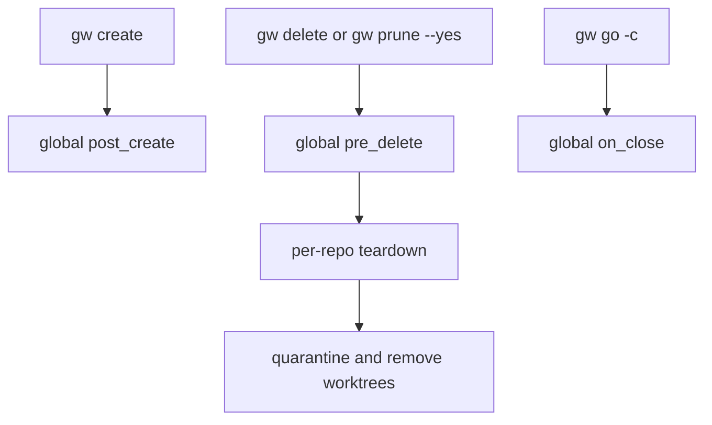
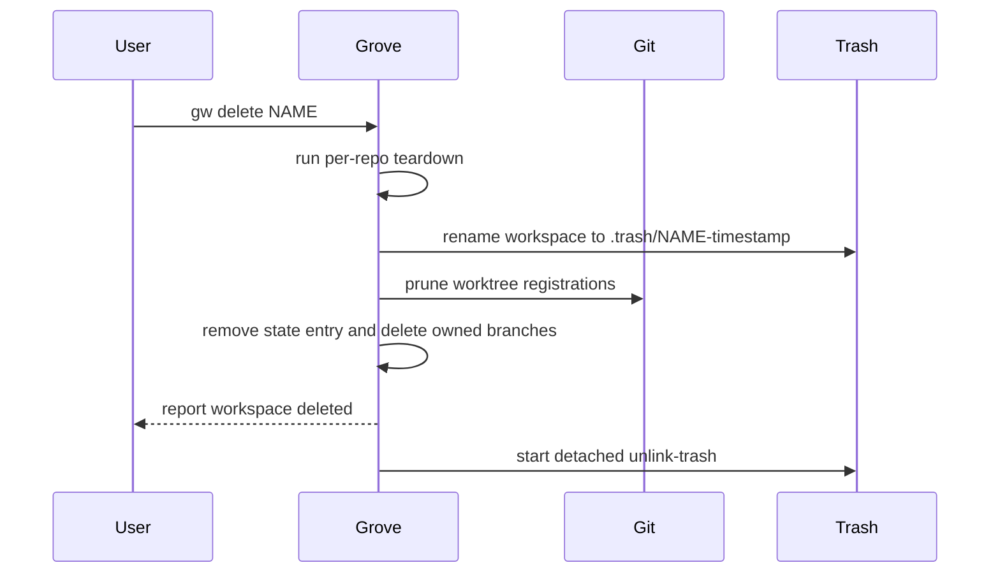

# Operations

Grove is a static `gw` binary for macOS and Linux; it requires `git` on `PATH`. It does not store credentials. Git authentication remains the responsibility of the user's SSH agent, `~/.ssh`, and Git credential helpers.

## Install and shell integration

Choose one installation path:

```bash
# Homebrew (macOS or Linux)
brew install nicksenap/grove/grove

# Official install script (macOS or Linux)
curl -fsSL https://raw.githubusercontent.com/nicksenap/grove/master/scripts/install.sh | sh

# Go toolchain
go install github.com/nicksenap/grove/cmd/gw@latest
```

The install script verifies the release checksum and chooses `/usr/local/bin`, falling back to `~/.local/bin`; `GW_INSTALL_DIR` and `GW_VERSION` override those choices. A source checkout can be built with `go build -o gw ./cmd/gw`, but that is a development path rather than an end-user upgrade method.

Install shell integration so commands that need to change the caller's directory can do so:

```bash
# Bash or Zsh: add to ~/.bashrc or ~/.zshrc
eval "$(gw shell-init)"
```

For Nushell:

```nu
gw shell-init --shell nu | save -f ~/.config/nushell/grove.nu
# Add to config.nu:
source grove.nu
```

The integration makes `gw go` change directory and lets `gw create` auto-cd into a newly created workspace. Without it, Grove cannot change the parent shell's directory. `gw create` uses `GROVE_CD_FILE` internally for the generated shell wrapper; do not set that variable manually unless debugging the shell integration.

Upgrade according to the installation method:

```bash
brew update && brew upgrade grove
# For the install script, run the curl command again.
go install github.com/nicksenap/grove/cmd/gw@latest
```

Normal commands may print a cached GitHub release notice. The check is non-blocking, refreshes at most every 24 hours, and stores its result separately in `~/.grove/update-check.json`. `gw unlink-trash` is an internal offline command and does not perform this check.

## Configuration surfaces

Grove's default root is `~/.grove`:

| Surface | Owner and purpose | Recovery guidance |
|---|---|---|
| `~/.grove/config.toml` | User configuration: repository roots, workspace root, presets, global hooks | Edit or regenerate with `gw init`; malformed TOML prevents normal loading. |
| `~/.grove/state.json` | Grove's registry of workspaces, worktrees, branches, timestamps, and optional source metadata | Do not hand-edit during operations; use `gw doctor`, workspace commands, or a backup. |
| `~/.grove/cache/remotes.json` | Best-effort remote URL cache for discovery | Safe to delete; missing or invalid JSON is treated as an empty cache. |
| `~/.grove/plugins/` | Executable `gw-<name>` plugins and installer metadata `.gw-<name>.json` | A manually copied plugin has no upgrade metadata. |
| `<workspace-dir>/<name>/` | Actual workspace and Git worktrees; default is `~/.grove/workspaces/<name>/` | Treat as user worktree data, not disposable registry data. |
| `<workspace-dir>/.trash/` | Temporary quarantine during deletion | Inspect ownership before removing; `gw doctor --fix` is the safe cleanup path. |
| `~/.grove/grove.log` | Info, warning, and error flight recorder; rotates at 1 MiB with three backups | Inspect with `tail`; avoid putting secrets in commands because hook commands are logged. |

### Global configuration

Initialize or add repository roots with:

```bash
gw init ~/dev ~/work/microservices
```

`gw init` resolves and validates each directory, merges it without duplicates, creates the Grove and workspace directories, and atomically saves configuration. The loader accepts the legacy `repos_dir = "~/dev"` field only for migration: it converts it to `repo_dirs = ["~/dev"]` and re-saves the file. If no config exists, commands that require one fail with `Grove not initialized. Run: gw init <repo-dir>`.

The important fields are:

```toml
repo_dirs = ["/home/me/dev", "/home/me/work"]
workspace_dir = "~/.grove/workspaces"

[presets]
backend = { repos = ["svc-auth", "svc-api"] }

[hooks]
post_create = "./scripts/workspace-created {path}"
pre_delete = "./scripts/workspace-closing {path}"
on_close = "./scripts/close-workspace-pane {path}"
```

Preset names must match `[a-zA-Z0-9_-]+`. Repository discovery scans configured roots to depth three, skips descending into a repository, resolves remotes in parallel (maximum 16 concurrent fetches), and deduplicates the same remote, preferring a direct child of a configured root over a nested clone. Discovery itself still runs per command; only remote resolution is cached for 24 hours and invalidated when `.git/config` mtime changes.

### Per-repository `.grove.toml`

A repository-root `.grove.toml` controls worktree behavior:

```toml
base_branch = "stage"
setup = ["pnpm install", "pnpm run build"]
teardown = "rm -rf node_modules"
pre_sync = "pnpm run build:check"
post_sync = "pnpm install"

# Consumed by gw-run, not Grove core:
pre_run = "docker compose pull"
run = "pnpm dev"
post_run = "docker compose down"
```

`setup` accepts a string or list and runs sequentially in the new worktree. `teardown` runs before removing a repo worktree. `pre_sync` and `post_sync` surround sync operations. These per-repo hook failures are warnings and do not block their parent operation. `run`, `pre_run`, and `post_run` are parsed by Grove but executed by the external `gw-run` plugin.

## Lifecycle hooks

Global hooks live under `[hooks]` in `config.toml`. Grove runs them with `sh -c` and expands `{name}`, `{path}`, `{branch}`, `{source_url}`, `{source_ref}`, and `{source_title}`. Non-empty values are single-quoted, including embedded quotes, to prevent placeholder values from becoming shell syntax; unused source placeholders expand to empty text.



This diagram shows which user-visible workspace actions trigger the three global lifecycle hooks.

A hook can be a command string or a metadata table:

```toml
[hooks.post_create]
command = "npm install && npm run build"
description = "Prepare the worktree"
stream = true
timeout = "5m"
on_failure = "abort"
```

- `stream = false` (default) captures combined output and stays silent on success; failed output is echoed to stderr with a `[hook_name]` prefix.
- `stream = true` sends line-prefixed progress to stderr, preserving stdout for shell integration.
- `timeout` accepts Go durations such as `30s` or `5m`; on supported macOS/Linux builds Grove kills the hook's process group and reports a timeout.
- `on_failure = "warn"` (default) logs and continues; `abort` makes the hook failure fatal when the calling operation honors it.

Skip global hooks for one invocation with the persistent flag:

```bash
gw --no-hooks create my-feature --repos svc-api
gw -n delete my-feature
```

`--no-hooks` does not disable per-repo `setup`, `teardown`, `pre_sync`, or `post_sync` commands. Keep hook commands free of tokens and passwords: they are plain text in `config.toml`, and expanded commands are logged.

## Plugins

A plugin is an executable named `gw-<name>`. Grove resolves built-ins first, then `~/.grove/plugins/gw-<name>`, then `$PATH`; on Unix it replaces the process with the plugin, giving it the terminal directly. Install a released plugin from GitHub:

```bash
gw plugin install nicksenap/gw-run
gw plugin install nicksenap/gw-dispatch
gw plugin install nicksenap/gw-recipe
gw plugin install igor-kupczynski/gw-code
```

The installer selects the current OS/architecture release asset, requires HTTPS, verifies the release checksum when available, and writes the executable plus `.gw-<name>.json` metadata. Manual installation is also supported:

```bash
cp my-plugin ~/.grove/plugins/gw-myplugin
chmod +x ~/.grove/plugins/gw-myplugin
```

Manage plugins with:

```bash
gw plugin list
gw plugin list --json
gw plugin upgrade dispatch
gw plugin upgrade                 # installer-managed plugins only
gw plugin remove dispatch
```

`upgrade` skips manually installed plugins because they have no source metadata. Plugins receive `GROVE_DIR`, `GROVE_CONFIG`, `GROVE_STATE`, and `GROVE_WORKSPACE` (when the current directory is inside a registered workspace). Plugins should read those files but use Grove commands rather than mutating Grove state directly.

## State, locking, and deletion

`state.json` stores each workspace's name, root path, common branch, creation timestamp, repo source/worktree paths, and optional opaque source information. Grove writes both configuration and state through a temporary file followed by rename; state-changing operations also take an exclusive Unix `flock` on `~/.grove/state.lock`. The lock is separate because `state.json` is atomically replaced. A missing state file means an empty workspace list; invalid JSON produces `corrupt state file (...). Run: gw doctor --fix`.

Deletion is deliberately two-phase:



This sequence shows why the command can return quickly while large workspace bytes are still being removed.

Before mutation Grove preflights worktrees, runs teardown outside the state lock, then reloads and rechecks under the lock. If pruning or state removal fails, it attempts to restore the quarantined root and repair worktrees. A failed child-process start falls back to synchronous unlinking; an unlink failure is logged as a warning. The hidden `gw unlink-trash PATH` command accepts only a direct child of `.trash`, protecting against arbitrary recursive deletion.

`gw prune` previews workspaces whose `created_at` is older than seven days by default; `--min-age N` changes the threshold and `--yes` performs deletion. It uses creation time rather than last navigation, skips malformed timestamps, and never deletes in preview mode. `--json` emits `name`, `branch`, `created_at`, and `age_days` for previews.

## Diagnostics and recovery

Run the health check before manually editing files:

```bash
gw doctor
gw doctor --json
gw doctor --fix
```

The check reports missing workspace roots, missing source repositories, worktree/path conflicts, and leftover quarantine entries. Without `--fix` it is read-only. With `--fix`, it runs state repairs under `state.lock` and removes only trash not identified as belonging to a still-registered workspace. If a registered workspace is missing but matching bytes remain in `.trash`, it reports `restore quarantined workspace or retry delete` rather than deleting those bytes. `--json` is useful for automation; a healthy human-readable run prints `All workspaces healthy`.

Common recoveries:

- **Not initialized or no repositories:** run `gw init <existing-directory>`, then verify discovery with `gw repos`.
- **Malformed configuration:** correct TOML and retry. For a legacy `repos_dir`, simply loading the config performs the supported migration; do not maintain both fields.
- **Corrupt state:** stop concurrent Grove commands, preserve a copy of `~/.grove/state.json`, and run `gw doctor --fix`; restore from backup if the registry needs recovery. Do not delete workspace directories merely to repair registry JSON.
- **Leftover `.trash`:** first confirm no delete or doctor cleanup is still running, then use `gw doctor` and `gw doctor --fix`. Do not invoke hidden `unlink-trash` with an arbitrary path.
- **Git authentication:** Grove disables interactive Git prompts (`GIT_TERMINAL_PROMPT=0`). Load the intended key (`ssh-add ~/.ssh/id_ed25519`), test `ssh -T git@github.com`, and fix the Git remote or credential helper rather than embedding credentials in config.
- **Hook failure or timeout:** inspect the prefixed stderr and `~/.grove/grove.log`; enable `stream = true` for progress, increase `timeout`, or choose `on_failure = "warn"` only when continuing is safe. Per-repo setup has no Grove timeout, so supervise unusually long commands in the command itself.
- **Workspace path already exists:** use `gw doctor` to distinguish stale state, a live workspace, and quarantine data. Do not overwrite a path manually; delete the registered workspace or choose another name after checking for uncommitted work.

For verbose diagnostics, put `--verbose` before the subcommand:

```bash
gw --verbose status my-feature
gw -v create my-feature
```

Debug logs go to `~/.grove/grove.log`; normal info, warnings, and errors are logged too. The log rotates at 1 MiB and keeps three backups.

## Source-development checks and releases

These are contributor checks, not required end-user troubleshooting:

```bash
just build                 # versioned development binary
go build -o gw ./cmd/gw
just check                 # tests, vet, formatting, gocyclo, staticcheck
just e2e                   # builds gw, then isolated e2e tests
GW_BIN="$PWD/gw" go test ./e2e -run TestCreateWorkspace -count=1 -v
go test ./internal/workspace -v
go test ./internal/discover -v
go test ./internal/config -v
```

Focused tests matter when changing persistence or cleanup: configuration tests cover defaults and legacy migration; state tests cover atomic persistence and cross-process locking; discovery tests cover depth-three scanning, cache invalidation, parallel resolution, and deduplication; workspace doctor and removal tests cover `.trash` ownership, restoration, branch deletion, and the guarded unlink path. E2E scenarios use an isolated temporary `HOME` and real Git fixtures; the public GitHub HTTPS clone is opt-in with `GROVE_EXTERNAL_E2E=1`.

A release is tagged and pushed with:

```bash
just release X.Y.Z
```

The recipe creates and pushes annotated tag `vX.Y.Z`. GitHub Actions and GoReleaser build static `darwin` and `linux` `amd64` and `arm64` archives, checksums, and the Homebrew formula. Update `CHANGELOG.md` before tagging; release automation, not an end-user workstation, owns the generated artifacts.

## Related guidance

- [Quickstart](quickstart.md) for first-use commands.
- [Workflows](workflows.md) for create, sync, reset, and delete behavior.
- [Integrations](integrations.md) for terminal and plugin integration.
- [Testing](testing.md) for the broader contributor test strategy.
