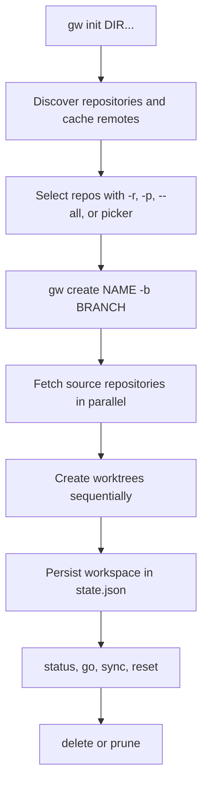

# Quickstart

Grove (`gw`) is a static Go CLI that coordinates one Git worktree per selected repository inside a named workspace. The repositories share the workspace branch name, while each repository may use its own configured base branch.

## 1. Install and enable shell integration

Grove requires Git on `PATH`. Choose one installation method:

```bash
brew install nicksenap/grove/grove
curl -fsSL https://raw.githubusercontent.com/nicksenap/grove/master/scripts/install.sh | sh
go install github.com/nicksenap/grove/cmd/gw@latest
```

The release script verifies its checksum and installs to `/usr/local/bin`, or `~/.local/bin` when needed; `GW_INSTALL_DIR` and `GW_VERSION` override those choices.

Install shell integration if you want `gw go` to change the calling shell's directory or `gw create` to auto-cd into a new workspace:

```bash
# Bash or Zsh: add to ~/.bashrc or ~/.zshrc
eval "$(gw shell-init)"

# Nushell: generate this file, then source grove.nu from config.nu
gw shell-init --shell nu | save -f ~/.config/nushell/grove.nu
```

Without the wrapper, Grove cannot change the parent shell's directory.

## 2. Initialize repository discovery

Register one or more existing directories that contain Git repositories:

```bash
gw init ~/dev ~/work/microservices
```

`gw init` resolves each path to an absolute directory, rejects paths that do not exist, merges and deduplicates them in `~/.grove/config.toml`, creates the Grove and workspace directories, saves configuration, and scans the configured directories. Remote lookups are cached in `~/.grove/cache/remotes.json`; later commands rediscover repositories from the configured roots.

Commands that need configuration fail with a message directing you to run `gw init`. The default workspace root is `~/.grove/workspaces`; both it and the repository roots can be changed through configuration. See [Operations](operations.md) for configuration files, state, cache, hooks, and recovery.

## 3. Create a workspace

For a deterministic, non-interactive creation, provide a branch and repository selection:

```bash
gw create feat-login -b feat/login -r svc-a,svc-b
# or:
gw create -b feat/login -p backend
gw create -b feat/login --all
```

The optional `NAME` defaults to the branch with `/` and spaces replaced by `-`. In a terminal, omitting repository selection opens a picker (presets are offered first), and omitting `-b` prompts for a branch. Selected repositories are validated before provisioning. A Git URL in `-r` can be cloned into the first configured repository directory when it is not already discovered.

Creation fetches selected source repositories concurrently, then creates their worktrees sequentially. Grove persists the workspace in `~/.grove/state.json` only after all worktrees exist. A provisioning failure rolls back worktrees, branches created by that attempt, and the workspace directory; per-repository setup from `.grove.toml` runs after the state commit and does not roll the workspace back. `--track` checks out an existing remote branch when available and otherwise falls back to creating one.



*This flow shows the safe initialization, provisioning, persisted-state, daily-use, and cleanup path.*

## 4. Inspect and work across repositories

```bash
gw list
gw ws show feat-login
gw status feat-login
gw go feat-login
gw sync feat-login
gw reset feat-login
```

`gw status` reports repository-specific branch and working-tree information. `gw sync` and `gw reset` operate across the workspace and continue reporting per-repository problems; `reset` returns repositories to the branch recorded for the workspace before syncing. `gw go` needs shell integration.

List-style commands support `--output` (`-o`) with `table`, `json`, `jsonl`, `tsv`, `name`, and `path`; `--json` / `-j` remains a compatibility alias for JSON. Query data goes to stdout while progress, prompts, warnings, and errors go to stderr, making pipelines safe to consume:

```bash
gw list -o name | fzf
gw status feat-login -o jsonl | jq -r 'select(.changed > 0) | .repo'
```

For sync ordering, reset behavior, hooks, rollback, and failure semantics, see [Workflows](workflows.md). For command and component boundaries, see [Architecture](architecture.md).

## 5. Clean up safely

Treat deletion and pruning as destructive. Review the target names, keep lifecycle hooks enabled unless bypassing them is deliberate, and run `gw doctor` before manually repairing state or quarantine data. Use `--no-hooks` (or `-n`) only when you understand that it skips global lifecycle hooks, including cleanup policy hooks.

```bash
gw delete feat-login                 # destructive named-workspace cleanup
gw prune                             # preview; default minimum age is 7d
gw prune --min-age 12h                # hours
gw prune --min-age 2w                 # weeks
gw prune --min-age 14                 # bare number means days
gw prune --json                      # machine-readable preview
gw prune --yes --min-age 7d          # attempt deletion of every candidate
gw doctor
gw doctor --fix
```

`gw prune` previews by default. Its `--min-age` accepts `h`, `d`, or `w` suffixes; a bare number means days, and invalid or negative values are rejected. Candidates are workspaces at least that old **plus every workspace whose directory is missing, regardless of age**. Table output marks a missing directory as `directory missing` in the **Note** column; JSON sets `missing` to `true`.

With `--yes`, Grove attempts every candidate rather than stopping at the first failure. A per-workspace deletion failure is recorded in JSON as `error` and in the table's **Note** column, followed by a failure summary; the command exits non-zero if any deletion fails. A missing directory skips quarantine but still removes each source repository's Git worktree registration, removes the state record, and attempts branch cleanup. An existing directory is first moved into sibling `.trash` quarantine so Git or state failures can restore it. See [Operations](operations.md) for recovery and [Workflows](workflows.md) for deletion sequencing.

## Task-routing map

- **Change command wiring, orchestration, state, Git, or output boundaries:** [Architecture](architecture.md)
- **Understand repositories, workspaces, worktrees, branches, timestamps, paths, and state invariants:** [Domain Concepts](concepts.md)
- **Trace init, discovery, create, status, sync, reset, navigation, delete, and prune:** [Workflows](workflows.md)
- **Install, configure, diagnose, recover cleanup, manage hooks, or release Grove:** [Operations](operations.md)
- **Integrate plugins, hooks, shells, Git, editors, or external automation:** [Integrations](integrations.md)
- **Choose focused tests, package checks, or end-to-end validation:** [Testing](testing.md)

## Focused validation

Contributors can run:

```bash
just check                         # tests, vet, formatting, complexity, staticcheck
just build                         # build gw
just e2e                           # build and run e2e tests against gw
go test ./internal/workspace -run TestName -v
go test ./cmd -run Prune -v
```

Prune unit tests cover default age, duration syntax, boundary and missing-directory selection, preview JSON, and continuing after a deletion failure. Workspace and end-to-end tests cover state, filesystem, Git worktree registration, and branch cleanup. See [Testing](testing.md) for test seams and the broader validation matrix.
