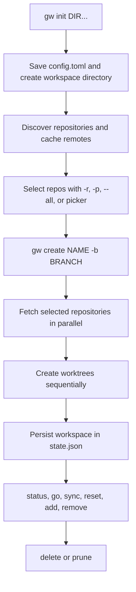

# Grove Documentation

**Grove** (`gw`) is a single static Go CLI that coordinates Git worktrees across multiple repositories. A workspace is a named directory containing one worktree per selected repository; the repositories share the workspace branch name while each repository may resolve its own base branch.

## Start here

Grove must be initialized before commands that need configuration. Initialization records and merges absolute repository-directory paths in `~/.grove/config.toml`, creates the Grove and workspace directories, then scans the configured directories for repositories. The scan is recursive to a bounded depth, avoids descending into a repository, deduplicates repositories by remote URL when available, and caches remote lookups in `~/.grove/cache/remotes.json`.

```bash
# Install with Homebrew, the verified release script, or Go:
brew install nicksenap/grove/grove
curl -fsSL https://raw.githubusercontent.com/nicksenap/grove/master/scripts/install.sh | sh
go install github.com/nicksenap/grove/cmd/gw@latest

# Bash or Zsh: enables gw go and post-create directory changes
eval "$(gw shell-init)"

# Nushell:
gw shell-init --shell nu | save -f ~/.config/nushell/grove.nu
# then source grove.nu from config.nu

# Required first-use step
gw init ~/dev ~/work/microservices

# Create and inspect a first workspace
gw create -b feat/login -r svc-a,svc-b
gw status feat-login
gw go feat-login
```

`gw create` can take a workspace `NAME`; when omitted, the name is derived from the branch by replacing `/` and spaces with `-`. In a terminal, omitted branch and repository selections are prompted interactively. Non-interactive use should supply `-b` and one of `-r`, `-p`, or `--all`. Repository URLs in `-r` may be cloned into the first configured repository directory when they are not already discovered.



*This flow shows the required initialization, discovery, creation, persisted-state, operation, and cleanup path.*

## What creation guarantees

The core create path validates all selected repository names before provisioning. It fetches repositories concurrently, then creates worktrees sequentially so a failure can remove worktrees, branches, and the workspace directory created by that invocation. Only after all worktrees exist is the workspace added to `~/.grove/state.json`; setup commands from per-repository configuration run after that commit and after the mutation lock is released. A failed fetch is warned about and local Git state is used instead. `--track` can check out an existing remote branch, falling back to creating a branch from the resolved base when the remote branch is absent.

The normal lifecycle is:

```bash
gw list                 # list known workspaces
gw ws show feat-login   # inspect one workspace
gw status feat-login    # status every worktree
gw sync feat-login      # rebase worktrees onto their configured base branches
gw reset feat-login     # return worktrees to the workspace branch, then sync
gw add-repo feat-login -r svc-c
gw remove-repo feat-login -r svc-c
gw rename feat-login --to login-work
gw delete login-work    # removes worktrees, branches, and workspace files
gw prune                # list workspaces older than seven days
gw prune --yes         # delete the listed workspaces
gw doctor               # diagnose workspace problems
```

Deletion and pruning are destructive cleanup operations. Use `--no-hooks` (or `-n`) when intentionally skipping lifecycle hooks; otherwise configured hooks can run around lifecycle operations. If state is corrupt, `gw doctor --fix` is the repair path named by the state loader.

## Configuration that matters

Global configuration is `~/.grove/config.toml`:

```toml
repo_dirs = ["~/dev", "~/work/microservices"]
workspace_dir = "~/.grove/workspaces"

[presets]
backend = { repos = ["svc-auth", "svc-api"] }

[hooks]
post_create = "./scripts/workspace-created {path}"
pre_delete = "./scripts/workspace-closing {path}"
```

`gw preset add backend -r svc-auth,svc-api` and `gw create -p backend` provide a reusable repository selection. A managed repository can also contain `.grove.toml` at its root:

```toml
base_branch = "stage"
setup = "pnpm install"
```

`base_branch` changes where a new worktree starts; `setup` accepts a command or list of commands and runs after creation. Treat `config.toml` and `state.json` as Grove-owned files: plugins may read them, but should mutate workspaces through Grove commands.

## Core commands versus plugins

Grove core owns repository discovery, Git worktree lifecycle, workspace state, status, synchronization, cleanup, hooks, and shell integration. It does **not** own agent automation, editor orchestration, per-repository process runners, or declarative workspace recipes.

An unknown top-level command is resolved after built-in commands: Grove searches `~/.grove/plugins/` and then `$PATH` for an executable named `gw-<name>`, and passes it the remaining arguments. Install released plugins from GitHub or place an executable in the plugin directory:

```bash
gw plugin install nicksenap/gw-run
gw run feat-login
```

`gw-run` runs per-repository `.grove.toml` `run` hooks. Declarative YAML workspace creation belongs to the external [`gw-recipe`](../docs/plugins.md) plugin, not to core Grove. See [Integrations](integrations.md) and [docs/plugins.md](../docs/plugins.md) for the plugin contract, environment variables, installation, and examples.

## Task-routing map

- **Change command wiring or component boundaries:** [Architecture](architecture.md)
- **Understand workspace, branch, discovery, provenance, and state invariants:** [Core Concepts](concepts.md)
- **Trace create, sync, reset, navigation, and cleanup behavior:** [Workflows](workflows.md)
- **Install, configure, diagnose, operate, or release Grove:** [Operations](operations.md)
- **Add or consume plugins, hooks, shell, editor, or automation integrations:** [Integrations](integrations.md)
- **Validate a change with focused tests, `just check`, or end-to-end tests:** [Testing](testing.md)

## Source and development entrypoints

The executable entrypoint is `cmd/gw/main.go`, which calls Cobra command setup and `cmd.Execute()`. Commands in `cmd/` validate input and invoke internal services; `internal/discover/` resolves repositories, `internal/workspace/` performs Git orchestration, `internal/gitops/` is the subprocess boundary, `internal/config/` owns TOML configuration, `internal/state/` atomically persists workspace records, and `internal/plugin/` manages external binaries.

For focused validation:

```bash
just check                         # tests, vet, formatting, complexity, staticcheck
just build                         # build gw
just e2e                           # build and run e2e tests against gw
go test ./internal/workspace -run TestName -v
```

Grove requires Go 1.25+ to build and Git on `PATH`. Begin source changes with [Architecture](architecture.md), then use [Testing](testing.md) to select the narrowest validation that covers the affected invariant.
