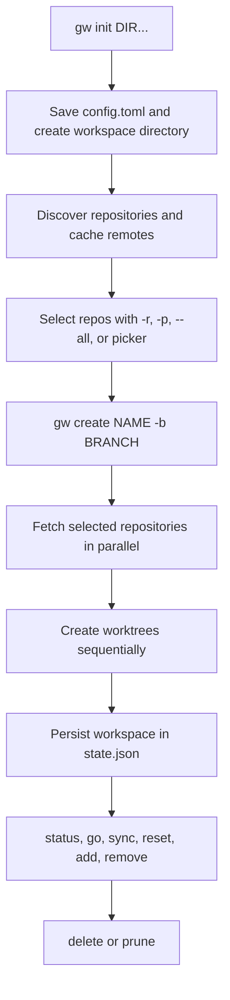

# Grove Documentation

**Grove** (`gw`) is a single static Go CLI that coordinates Git worktrees across multiple repositories. A workspace is a named directory containing one worktree per selected repository; the repositories share the workspace branch name, while each repository can resolve its own base branch.

## Start here

Initialize Grove before commands that require configuration. `gw init` merges and validates absolute repository-directory paths in `~/.grove/config.toml`, creates the Grove and workspace directories, and scans the configured directories for repositories. Discovery is bounded, does not descend into a repository, deduplicates repositories by remote URL when available, and caches remote lookups in `~/.grove/cache/remotes.json`.

```bash
# Install with Homebrew, the verified release script, or Go:
brew install nicksenap/grove/grove
curl -fsSL https://raw.githubusercontent.com/nicksenap/grove/master/scripts/install.sh | sh
go install github.com/nicksenap/grove/cmd/gw@latest

# Bash or Zsh: enables gw go and post-create directory changes
eval "$(gw shell-init)"

# Nushell:
gw shell-init --shell nu | save -f ~/.config/nushell/grove.nu
# then source grove.nu from config.nu

# Required first-use step
gw init ~/dev ~/work/microservices

# Create and inspect a first workspace
gw create -b feat/login -r svc-a,svc-b
gw status feat-login
gw go feat-login
```

`gw create` accepts an optional workspace `NAME`; if omitted, Grove derives it from the branch by replacing `/` and spaces with `-`. In a terminal, omitted branch and repository selections are prompted interactively. For non-interactive use, provide `-b` and one of `-r`, `-p`, or `--all`. A repository URL supplied through `-r` can be cloned into the first configured repository directory when it is not already discovered.



*This flow shows the required initialization, discovery, creation, persisted-state, operation, and cleanup path.*

## Creation and daily lifecycle

Before provisioning, Grove validates every selected repository. It fetches source repositories concurrently, then creates worktrees sequentially. A provisioning failure rolls back worktrees, branches created by that invocation, and the workspace directory. Grove writes the workspace to `~/.grove/state.json` only after all worktrees exist; per-repository setup commands run after that commit and outside the mutation lock. A fetch failure is warned about and local Git state is used. `--track` checks out an existing remote branch when available and otherwise falls back to creating a branch from the resolved base.

```bash
gw list
gw ws show feat-login
gw status feat-login
gw sync feat-login
gw reset feat-login
gw add-repo feat-login -r svc-c
gw remove-repo feat-login -r svc-c
gw rename feat-login --to login-work
gw go feat-login
```

`gw go` needs the shell integration above to change the caller's directory. `status`, `sync`, and `reset` operate across the workspace's repositories and report repository-specific problems; use [Workflows](workflows.md) for ordering, rollback, hooks, and failure behavior.

## Safe cleanup

Deletion and pruning are destructive operations. Review names before deleting, keep hooks enabled unless you intentionally use `--no-hooks` (or `-n`), and use `gw doctor` before manually touching state or quarantine data. The normal delete path performs safety checks; the top-level `gw delete` command invokes forced cleanup after selection, so treat it as data-loss capable.

```bash
gw delete login-work                 # destructive: remove a named workspace
gw list -o name | grep '^old-' | gw delete --stdin --yes

gw prune                             # preview: default minimum age is 7d
gw prune --min-age 12h                # hours are supported
gw prune --min-age 2w                 # weeks are supported
gw prune --min-age 14                 # a bare number means days
gw prune --json                      # JSON preview
gw prune --yes --min-age 7d          # delete the candidates

gw doctor                            # inspect inconsistencies
gw doctor --fix                      # apply supported repairs
```

`--min-age` accepts `12h`, `7d`, or `2w`; the default is `7d`, and negative values or unknown units are rejected. Prune candidates are workspaces whose parseable `created_at` is at least the selected age old **plus every workspace whose directory is missing, regardless of age**. In table output, missing directories are marked `directory missing` in the **Note** column; in JSON they have `"missing": true`. Without `--yes`, prune only previews. With `--yes`, each candidate goes through the delete path.

If a workspace directory is already missing, deletion skips quarantine because there is no directory to move, but still prunes Git worktree registrations and removes the workspace from state (and attempts branch cleanup). Existing directories are quarantined before Git and state cleanup so failures can be restored. This is why cleanup should be reviewed as destructive; detailed sequencing and recovery behavior are in [Workflows](workflows.md) and [Operations](operations.md).

## Configuration and extension boundary

Global configuration is `~/.grove/config.toml`:

```toml
repo_dirs = ["~/dev", "~/work/microservices"]
workspace_dir = "~/.grove/workspaces"

[presets]
backend = { repos = ["svc-auth", "svc-api"] }

[hooks]
post_create = "./scripts/workspace-created {path}"
pre_delete = "./scripts/workspace-closing {path}"
```

A managed repository can contain `.grove.toml`:

```toml
base_branch = "stage"
setup = "pnpm install"
```

`base_branch` controls the starting point for a new worktree; `setup` runs after creation. Grove owns discovery, Git worktree lifecycle, state, hooks, shell integration, and cleanup. It does not own agent automation, editor orchestration, process runners, or declarative workspace recipes. Unknown top-level commands resolve to an executable named `gw-<name>` in `~/.grove/plugins/`, then on `$PATH`; plugins should use Grove commands rather than editing state directly.

```bash
gw plugin install nicksenap/gw-run
gw run feat-login
```

See [Integrations](integrations.md) for plugin, hook, shell, and Git boundaries.

## Task-routing map

- **Change command wiring, operation orchestration, or component boundaries:** [Architecture](architecture.md)
- **Understand workspaces, worktrees, branches, timestamps, missing paths, and state invariants:** [Domain Concepts](concepts.md)
- **Trace initialization, creation, sync, reset, navigation, deletion, and pruning:** [Workflows](workflows.md)
- **Install, configure, diagnose, clean up, or release Grove:** [Operations](operations.md)
- **Add or consume plugins, hooks, shell, editor, or automation integrations:** [Integrations](integrations.md)
- **Choose focused tests, `just check`, or end-to-end validation:** [Testing](testing.md)

## Source and development entrypoints

The executable entrypoint is `cmd/gw/main.go`, which sets up Cobra commands and calls `cmd.Execute()`. Commands in `cmd/` validate input and invoke internal services; `internal/discover/` resolves repositories, `internal/workspace/` performs Git orchestration, `internal/gitops/` is the subprocess boundary, `internal/config/` owns TOML configuration, `internal/state/` atomically persists workspace records, and `internal/plugin/` manages external binaries.

For focused validation:

```bash
just check                         # tests, vet, formatting, complexity, staticcheck
just build                         # build gw
just e2e                           # build and run e2e tests against gw
go test ./internal/workspace -run TestName -v
```

The focused cleanup tests cover duration parsing, age filtering, missing-directory candidates, preview markers, tolerant deletion, and end-to-end state/filesystem/Git cleanup (`cmd/prune_test.go`, `internal/workspace/remove_test.go`, `e2e/prune_test.go`). Grove requires Go 1.25+ to build and Git on `PATH`.
