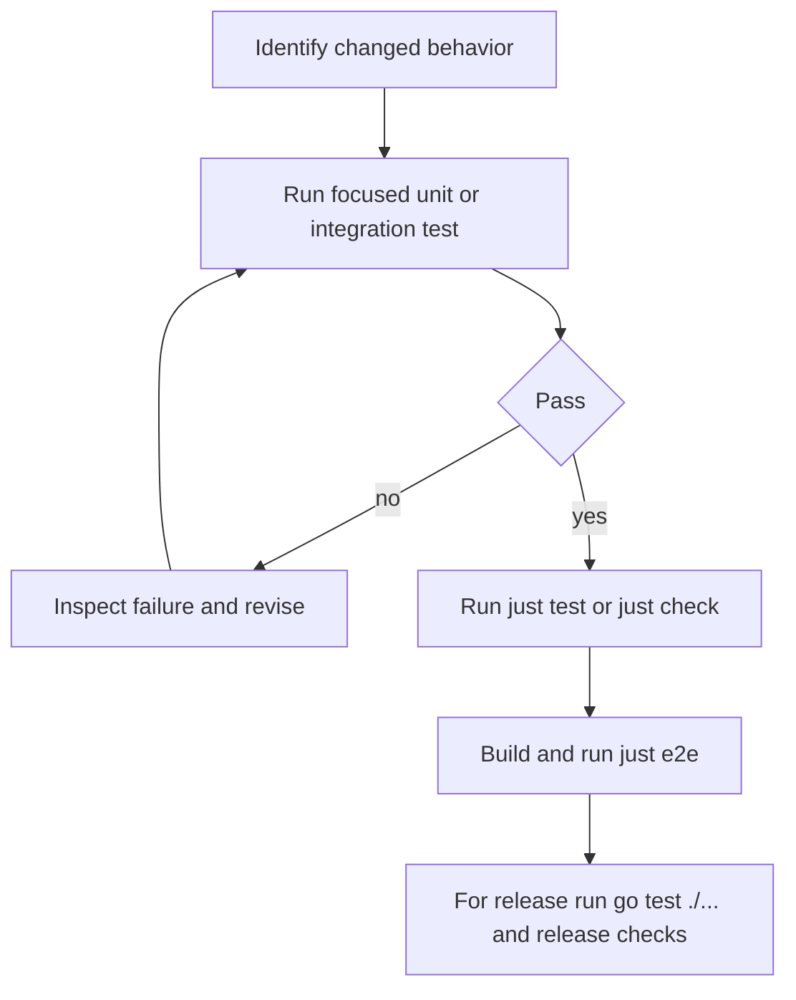
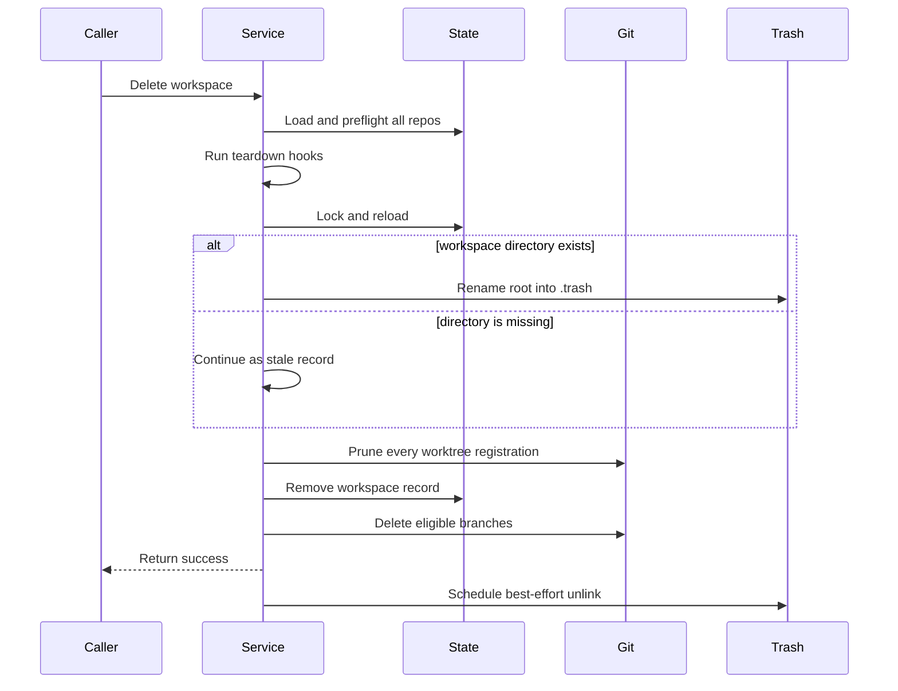

# Testing and Change Validation

Grove has three useful validation layers: focused package tests for a change, the repository quality gate, and end-to-end tests that invoke the compiled `gw` binary. Start narrow, preserve the complete failure output, and broaden only after the smallest relevant test is green.



This is the recommended progression from a targeted proof to repository and binary-level validation.

## Fastest useful commands

Use the smallest command that proves the behavior under change:

```sh
# One focused package test
 go test ./cmd -run 'TestParseMinAge|TestPruneCandidates' -v
 go test ./internal/workspace -run 'TestDeleteWithMissingDirectory|TestDeletePreflights' -v
 go test ./internal/plugin -run 'TestEmbeddedRegistry|TestParseRegistry' -v

# All Go package tests
just test
# Equivalent: go test ./... [optional extra arguments]

# Full local quality gate
just check

# Compiled-binary end-to-end suite
just e2e
```

`just test` runs `go test ./...`. `just check` runs `test`, `vet`, `fmt-check`, `gocyclo`, and `staticcheck`; `fmt-check` fails if `gofmt -l .` reports files and does not rewrite them. The complexity and static-analysis recipes install `gocyclo` or `staticcheck` when absent. Use `gofmt -w .` deliberately to repair formatting.

For Cobra parsing and preview formatting, `cmd` is the narrowest boundary. For candidate selection, registry validation, or deletion ordering, prefer the owning `internal` package. `e2e` is reserved for observable CLI behavior, filesystem effects, Git registrations, and plugin dispatch.

## Prune duration and candidate invariants

`cmd/prune.go` owns both `--min-age` parsing and candidate presentation. `parseMinAge` trims surrounding whitespace, rejects empty input and negative values, accepts hours (`12h`), days (`7d`), and weeks (`2w`), and preserves compatibility with a bare number by interpreting it as days (`14`). Invalid units and malformed values such as `7x`, `d`, and `abc` must fail rather than silently selecting a duration. Zero is valid (`0d`). The command default is `7d`; `--yes` defaults to false, so the normal operation is a preview.

`TestParseMinAge` in `cmd/prune_test.go` is the compact unit contract. Keep explicit cases for `h`, `d`, `w`, bare-number days, zero, empty input, negative values, and invalid units. `TestPruneCommandDefaults` protects the CLI defaults independently of parser behavior.

Candidate selection has two independent reasons to include a state record:

- a parseable `created_at` is at least `minAge` old (the boundary is inclusive);
- its workspace directory is missing on disk.

A missing directory wins regardless of age. The candidate retains its name, branch, creation timestamp, and computed `age_days`, and sets `missing: true`. Records with invalid timestamps are not selected solely for age, but a missing path still makes them candidates. Selection preserves state order, which keeps preview and deletion order deterministic.

The preview contract is also observable: JSON emits `[]` rather than `null` for no candidates, and a missing candidate must include `"missing": true`. The table includes a `Note` column whose value is `directory missing`; this note distinguishes stale state from an old but present workspace. `TestPruneCandidatesIncludesMissingDirectoryRegardlessOfAge` and `TestWritePrunePreviewEmptyJSON` cover the selection and empty-JSON edges; retain or extend preview tests to assert the missing JSON field and table note when changing output.

With `--yes`, `runPrune` passes every candidate through the same forced workspace deletion service used by `gw delete`, then prints the candidate result. The end-to-end prune tests cover dry-run non-deletion, deletion of an old workspace including its source branch, retention of a recent workspace, and the default `7d` threshold. A complete prune change should run both the focused `cmd` tests and `go test ./e2e -run TestPrune -count=1`.

## Workspace deletion and tolerant cleanup

Workspace deletion is a two-phase operation. `internal/workspace/remove.go` first validates the state record and preflights every repository, runs teardown hooks, then takes the state lock. Under the lock it either moves an existing workspace root into `.trash` or recognizes an already-missing root, prunes Git worktree registrations, removes the state record, and attempts branch cleanup. Only after state removal does it schedule best-effort trash unlinking. A spawned unlink failure falls back to synchronous unlinking; leftover trash must not keep a deleted workspace in state or block immediate name reuse.



The missing-directory path is deliberately tolerant but not a no-op: deletion must continue through Git registration cleanup and state cleanup, and must not quarantine anything because there are no workspace bytes to move. `TestDeleteWithMissingDirectoryCleansStaleRecord` verifies the stale record disappears, the worktree registration is pruned, and `.trash` remains empty. This is the invariant used by prune to clean records whose directories were removed out of band.

The neighboring deletion tests protect the failure boundaries that must not regress:

- `TestDeletePreflightsEveryRepoBeforeRemovingAny` requires all repositories to pass preflight before mutation begins.
- Dirty worktrees fail safe without `Force`; prune and the CLI use force because they are explicit destructive cleanup paths.
- Worktree-prune or state-removal failures restore a quarantined root and preserve state when possible.
- Successful deletion removes state and branches as allowed, while `PreserveBranch` and unmerged-branch policy protect user work.
- Normal existing-root deletion may quarantine and unlink asynchronously; missing-root deletion must not quarantine. Tests that inspect `.trash` must account for that asynchronous boundary or inject the unlink hooks.

`internal/workspace/remove_test.go` is the unit/integration boundary for these lifecycle and rollback guarantees. `cmd/delete_test.go` only validates name input rules: trimming and deduplicating lines, accepting multiple arguments, and requiring `--yes` for `--stdin`; it should not duplicate service cleanup tests. `e2e/prune_test.go` proves the user-visible cleanup and source-branch effects.

## Plugin registry and dispatch coverage

The embedded registry in `internal/plugin/registry.json` is a small curated install-name lookup. It currently contains only `code` and `dispatch`; each entry has a name, repository, and description. `internal/plugin/registry.go` parses and validates the registry before exposing it, validates plugin names and repository syntax, rejects duplicate names, and returns entries sorted by name. Search matches name, repository, or description case-insensitively. A bare install argument is resolved through this registry, while an argument containing `/` is treated as an explicit repository reference.

The registry invariant is therefore stronger than “the JSON parses”: every entry has a valid plugin name and repository, names are unique, and consumers receive deterministic sorted output. `TestEmbeddedRegistryIsValid` checks the shipped entries and descriptions; `TestParseRegistryRejectsDuplicatesAndBadRepos` checks malformed registry data; search and resolution tests protect lookup semantics. When adding a registry entry, keep the JSON schema small, update the registry tests if the contract changes, and verify both name and `owner/gw-name` repository conventions.

Keep plugin tests at three distinct boundaries:

1. **Unit tests (`internal/plugin`)** isolate filesystem and registry behavior: plugin directories are derived from `config.GroveDir`, only executable `gw-` files are listed, unsafe names are rejected, missing directories are harmless, removal cleans metadata, and registry and release-resolution failures are reported.
2. **Integration tests (`cmd` plus internal services)** should cover CLI argument handling and the handoff from a registry name to install or dispatch without re-testing shell execution or Git repository setup.
3. **End-to-end tests (`e2e/plugin_test.go`)** create an executable under the isolated Grove plugin directory, verify human and JSON `plugin list`, invoke the unknown top-level command fallback with forwarded arguments and `GROVE_DIR`, and verify removal and unknown-command failures. These tests exercise the actual compiled binary rather than calling `internal/plugin` directly.

## End-to-end environment and scope

The `e2e` package tests Grove as a user would, not by calling internal services. `TestMain` uses `GW_BIN` when supplied; otherwise it builds `./cmd/gw` into a temporary executable. Each test gets an isolated temporary `HOME`, repositories, `.grove` directory, and Git identity; system Git configuration and ambient Git variables are constrained. Run one scenario with `go test ./e2e -run TestName -count=1`.

The required suite uses local repositories and `file://` remotes, including workspace lifecycle, repository add/remove, tracking an existing remote branch, source metadata, sync/reset, presets, diagnostics, plugins, prune, and doctor. The public HTTPS clone test is deliberately opt-in:

```sh
GROVE_EXTERNAL_E2E=1 GW_BIN="$PWD/gw" go test ./e2e -count=1
```

`GROVE_EXTERNAL_E2E=1` enables only the public HTTPS clone check. `GW_BIN` points tests at an already-built binary; if unset, e2e builds one itself. `just e2e` builds `gw` first and runs `GW_BIN="<repository>/gw" go test ./e2e -count=1` without enabling external network coverage.

The e2e helpers use a 45-second per-command default timeout and retain stdout, stderr, exit code, and errors in assertions. Failed commands include the complete invocation and both output streams, making CLI failures actionable.

## CI, release, and change checklist

Pull requests and pushes to `master` run package tests and vet in the `check` job, then build `gw` and run the e2e suite in a separate job. The installer matrix checks Ubuntu and macOS installation and `gw --version`. A tagged release runs `go test ./...` before release-note extraction and GoReleaser.

Before merging a change:

1. Identify the owning boundary and run its narrowest named test.
2. For prune changes, test all duration units, compatibility and rejection cases, age boundaries, missing-directory selection, JSON `missing`, and the `directory missing` table note.
3. For deletion changes, test preflight ordering, tolerant stale-record cleanup, Git registration removal, state cleanup, quarantine behavior, rollback, and asynchronous unlinking.
4. For registry or plugin changes, run validation and sorting tests, then the appropriate CLI and e2e dispatch coverage.
5. Run `just test`, `just check`, and `just e2e`; add `GROVE_EXTERNAL_E2E=1` only when network-dependent coverage is intentional.
6. For release work, also run `go test ./...` and verify installer and changelog/tag readiness before `just release`.
