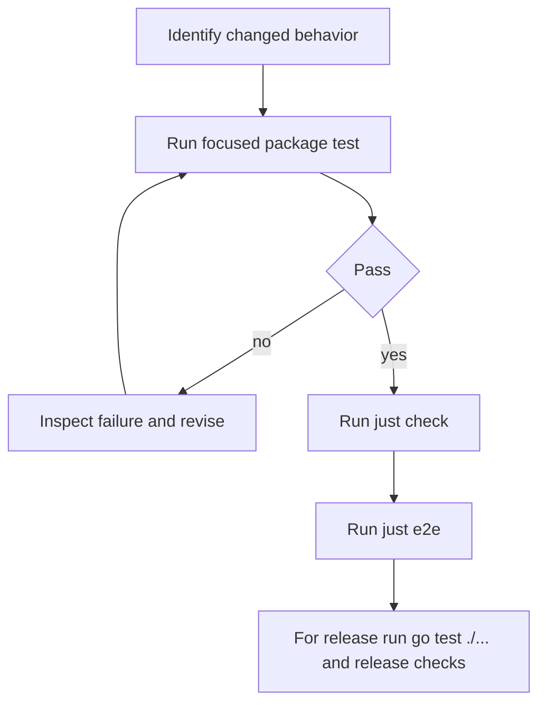
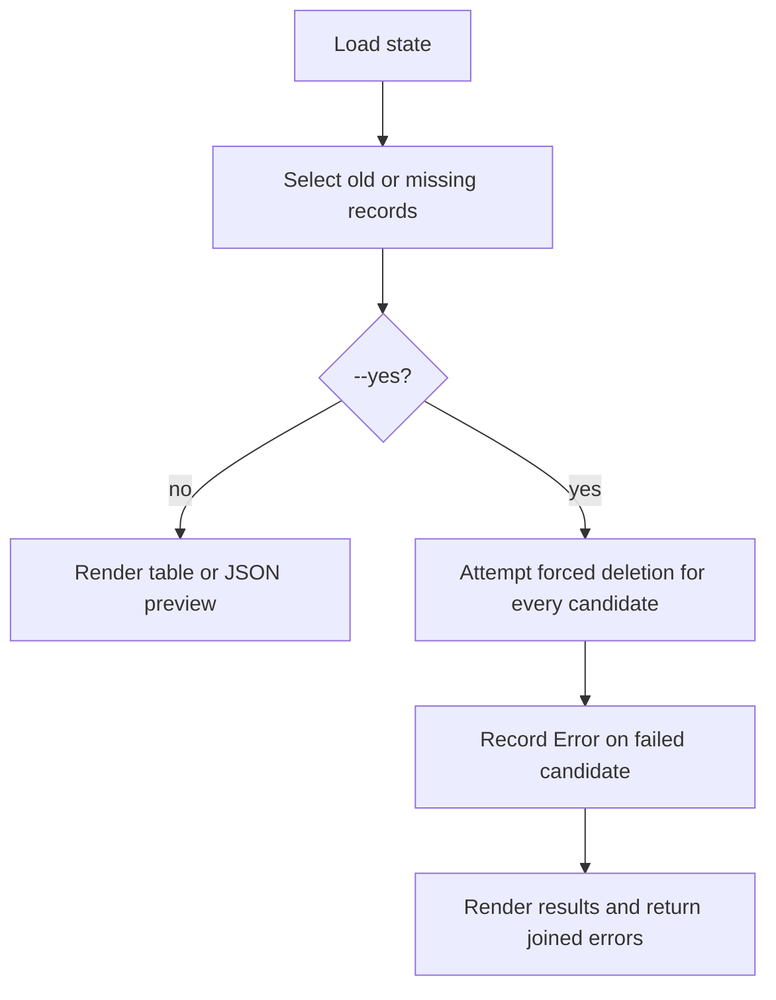
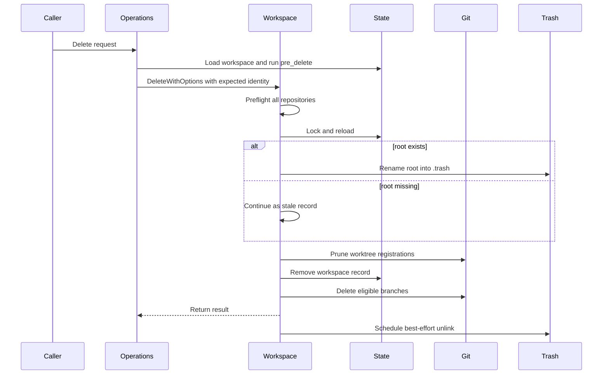

# Testing and Change Validation

Grove has three useful validation layers: focused package tests for a change, the repository quality gate, and end-to-end tests that invoke the compiled `gw` binary. Start narrow, preserve the complete failure output, and broaden only after the smallest relevant test is green.



This diagram shows the recommended progression from a targeted proof to repository and binary-level validation.

## Commands and test boundaries

Use the smallest command that proves the behavior under change:

```sh
# One focused package test
go test ./cmd -run 'TestParseMinAge|TestPruneCandidates' -v
go test ./internal/workspace -run 'TestDeleteWithMissingDirectory|TestDeletePreflights' -v

# All Go package tests
just test
# Equivalent: go test ./... [optional extra arguments]

# Full local quality gate
just check

# Compiled-binary end-to-end suite
just e2e
```

`just test` runs `go test ./...`. `just check` runs `test`, `vet`, `fmt-check`, `gocyclo`, and `staticcheck`; `fmt-check` fails if `gofmt -l .` reports files and does not rewrite them. The complexity and static-analysis recipes install `gocyclo` or `staticcheck` when absent. Use `gofmt -w .` deliberately to repair formatting. AGENTS.md recommends `go test ./internal/workspace -run TestName -v` for a single test and `just e2e` for the e2e suite.

For Cobra parsing and preview formatting, `cmd` is the narrowest boundary. For state persistence, operation ordering, candidate selection, and deletion lifecycle, prefer the owning `internal` package. `e2e` is reserved for observable CLI behavior, filesystem effects, Git registrations, and branch changes.

## Prune coverage

`cmd/prune.go` owns `--min-age` parsing, candidate selection, preview rendering, and the loop that invokes deletion. `parseMinAge` trims input; accepts hours (`12h`), days (`7d`), weeks (`2w`), and bare numbers interpreted as days for compatibility; accepts zero; and rejects empty, negative, malformed, and unsupported-unit values. The command default is `7d`, while `--yes` and `--json` default to false.

`TestParseMinAge` in `cmd/prune_test.go` is the compact parser contract. `TestPruneCommandDefaults` protects the CLI defaults independently. Keep both focused tests when changing flags or duration syntax.

Candidate selection has two independent inclusion rules:

- a parseable `created_at` is at least `minAge` old; the age boundary is inclusive;
- the workspace directory is missing on disk, regardless of age or whether its timestamp parses.

Selection preserves state order. A candidate retains its name, branch, creation timestamp, and computed `age_days`; a missing directory sets `missing: true`. `TestPruneCandidatesReportsAgeDays`, `TestPruneCandidatesIncludesMissingDirectoryRegardlessOfAge`, and `TestPruneCandidatesBoundaryAndUnparseable` cover age calculation, the inclusive boundary, invalid timestamps, injected existence checks, and missing-directory inclusion.

Preview output is part of the CLI contract: JSON emits `[]` rather than `null` when there are no candidates, and JSON candidates expose `missing`. Human output uses a `Note` column with `directory missing`; after deletion it reports `deleted`, and a failed deletion reports `FAILED: ...`. `TestWritePrunePreviewJSON` and `TestWritePrunePreviewEmptyJSON` cover JSON serialization and the empty case.

With `--yes`, `runPrune` passes every candidate through the same forced workspace deletion service used by `gw delete`. `deleteCandidates` does not stop at the first failure: it attempts all candidates, mutates only the failed candidate's `Error`, and returns joined errors naming each failed workspace. `TestDeleteCandidatesContinuesAfterFailure` protects all three properties: ordering, continued attempts, and per-candidate error mutation.



This flow shows that preview is non-destructive and that deletion attempts are independent rather than fail-fast.

## Workspace deletion invariants and seams

Workspace deletion is a two-phase operation. `internal/workspace/remove.go` validates the state record and preflights every repository, runs teardown hooks, then takes the state lock. Under the lock it reloads and rechecks state, moves an existing workspace root into `.trash` or recognizes an already-missing root, prunes Git worktree registrations, removes the state record, and attempts branch cleanup. Only after state removal does it schedule best-effort trash unlinking.

A missing root is a stale record, not a no-op: forced deletion still removes Git worktree registrations, state, and eligible branches, and does not quarantine anything. Existing-root deletion can quarantine asynchronously. If spawning the unlink fails, cleanup falls back to synchronous unlinking; leftover trash must not keep a deleted workspace in state or block immediate name reuse.

The neighboring `internal/workspace/remove_test.go` tests protect the failure boundaries that must not regress:

- `TestDeletePreflightsEveryRepoBeforeRemovingAny` requires all repositories to pass preflight before mutation begins.
- Dirty worktrees fail safe without `Force`; prune uses force because it is an explicit destructive cleanup path.
- Worktree-prune or state-removal failures restore a quarantined root and preserve state when possible.
- Successful deletion removes state and eligible branches, while `PreserveBranch` and unmerged-branch policy protect user work.
- `TestDeleteWithMissingDirectoryCleansStaleRecord` verifies stale-record cleanup, Git registration removal, and an empty `.trash`.
- The unlink tests verify ordering, asynchronous scheduling, the spawn-failure fallback, safe trash-path validation, and immediate name reuse.

Use the injected seams rather than sleeps or fragile filesystem races: workspace tests can replace `PruneWorktree`, `RepairWorktree`, `RemoveState`, `StartUnlink`, and `UnlinkTrash`. The operation service also accepts injected workspace, state, hook, and warning functions. Its tests verify hook ordering, abort-versus-warning behavior, and that delete passes the authorized `ExpectedCreatedAt` and `ExpectedPath` identity to the lower-level service.



This sequence shows the operation-level hook boundary and the state-safe deletion ordering.

## State fixtures and package tests

State tests use `t.TempDir()` to create an isolated `.grove` directory and `state.NewStore`, initialize an empty JSON array, and then exercise load, add, update, rename, remove, JSON persistence, atomic writes, and process serialization. This keeps tests independent of a developer's `~/.grove` and makes lock behavior reproducible.

The workspace test helper similarly creates temporary Grove, workspace, and repository directories, initializes a temporary `state.Store`, and constructs a service with test-local configuration and stats. It creates real local Git repositories only where Git behavior matters. Preserve this boundary when adding tests: use fakes for ordering and injected failures, and use the temporary service environment for worktree, branch, quarantine, and state invariants.

The operations tests are intentionally not shell-level tests. They use a fake workspace/store and record calls to prove that creation runs `post_create` after state creation, deletion runs `pre_delete` first, aborting hooks prevent deletion, warning hooks permit it, and identity checks are propagated. This is the right seam for lifecycle policy; `internal/workspace` remains focused on filesystem and Git mechanics.

## End-to-end environment and scope

The `e2e` package tests Grove as a user would, not by calling internal services. `TestMain` uses `GW_BIN` when supplied; otherwise it builds `./cmd/gw` into a temporary executable. `newEnv` gives each test a temporary `HOME`, repositories, `.grove` directory, workspace directory, Git identity, and a 45-second per-command timeout. Commands retain stdout, stderr, exit code, and errors; failed assertions include the complete invocation and both output streams.

The required suite uses local repositories and `file://` remotes, including workspace lifecycle, repository operations, hooks, plugins, prune, and doctor. The public HTTPS clone test is opt-in:

```sh
GROVE_EXTERNAL_E2E=1 GW_BIN="$PWD/gw" go test ./e2e -count=1
```

`GROVE_EXTERNAL_E2E=1` enables only the network-dependent clone check. `GW_BIN` points tests at an already-built binary; if unset, e2e builds one itself. `just e2e` builds `gw` first and runs `GW_BIN="<repository>/gw" go test ./e2e -count=1` without enabling external network coverage.

The prune e2e tests are the user-visible regression suite:

- `TestPruneListsOldWorkspacesWithoutDeleting` proves preview JSON and dry-run non-deletion;
- `TestPruneYesDeletesOldWorkspaces` proves old-workspace deletion, recent-workspace retention, source-branch deletion, state removal, and filesystem removal;
- `TestPruneDefaultMinAgeKeepsRecentWorkspaces` protects the default `7d` threshold.

Run one scenario with `go test ./e2e -run TestPrune -count=1`; run the complete compiled-binary suite with `just e2e`. The e2e cleanup helper waits for background `unlink-trash` work before temporary-directory cleanup, so tests do not race asynchronous deletion.

## Change checklist

1. Identify the owning boundary and run its narrowest named test.
2. For prune changes, test every duration unit, compatibility and rejection case, the inclusive age boundary, invalid timestamps, missing-directory selection, JSON `missing` and `[]`, table notes, all-candidate attempts, and per-candidate errors.
3. For deletion changes, test preflight ordering, tolerant stale-record cleanup, Git registration removal, state cleanup, quarantine and rollback, branch policy, and asynchronous unlinking.
4. For operation or hook changes, test ordering and abort-versus-warning policy with injected dependencies rather than invoking a shell.
5. Run `just test`, `just check`, and `just e2e`; add `GROVE_EXTERNAL_E2E=1` only when network-dependent coverage is intentional.
6. For release work, also run `go test ./...` and verify installer and changelog/tag readiness before `just release`.
