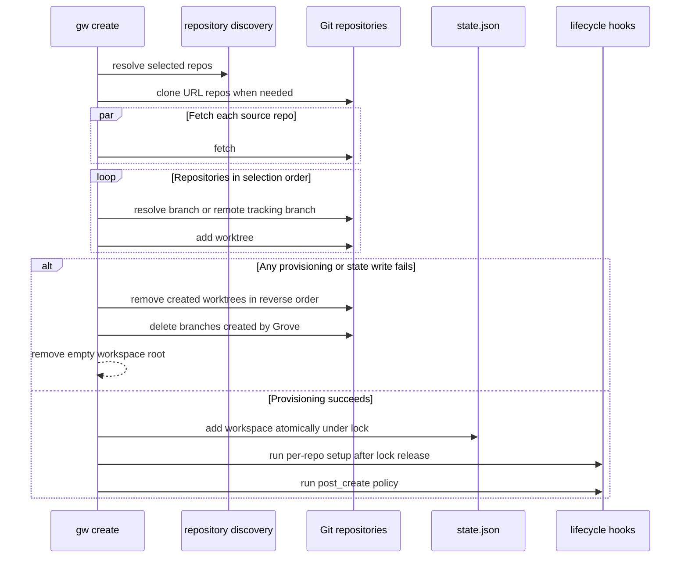
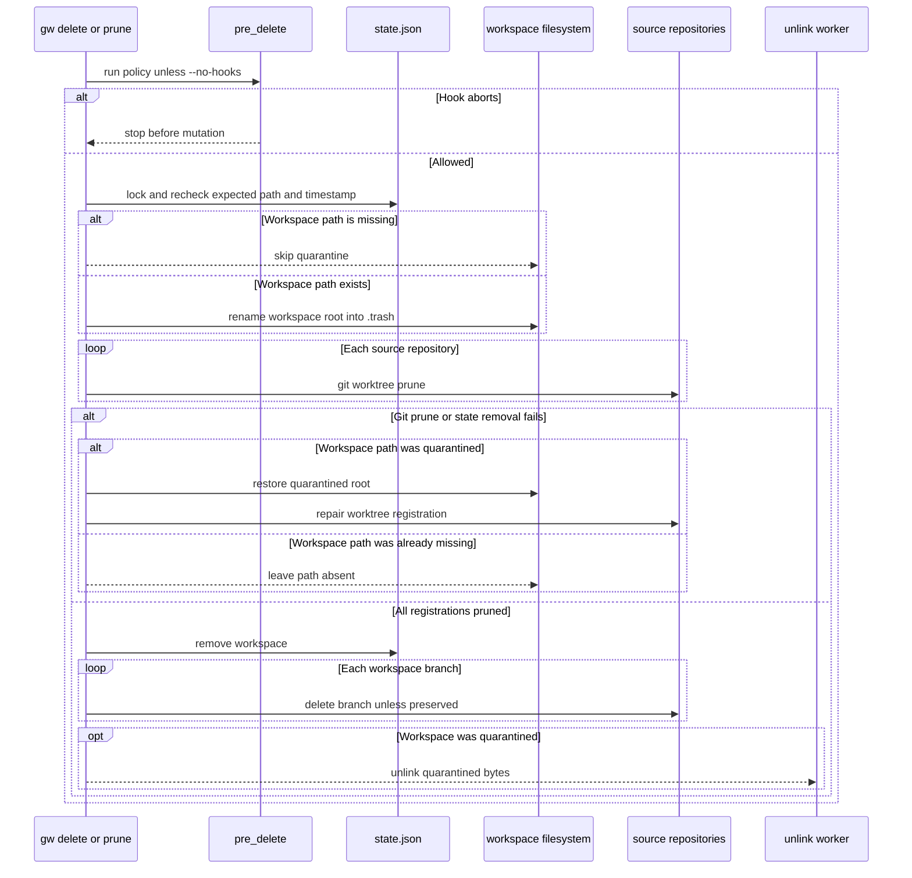

# Workflows

Grove manages a workspace as persisted metadata plus one Git worktree per repository. Commands resolve repositories from configured directories, mutate worktrees, and update `~/.grove/state.json`; commands that operate on several repositories generally continue independently and report repository-specific warnings.

## Initialize and discover repositories

```bash
gw init ~/dev ~/work/microservices
```

`gw init` initializes Grove configuration with the supplied repository directories, saves it, and immediately scans those directories with the discovery cache. Later repository commands rediscover from the configured directories. A workspace creation can also accept a remote Git URL in `--repos` (and `gw add-repo --repos`); Grove clones it into the first configured `repo_dir` before continuing, and rejects a name collision with a different local path. `cmd/init_cmd.go` delegates configuration initialization to `internal/config`, while discovery is performed by `discover.DiscoverReposWithCache` (`cmd/init_cmd.go#L10-L26`, `cmd/create.go#L37-L80`, `cmd/addrepo.go#L32-L57`).

## Create: provision, persist, then run hooks

Typical non-interactive creation is:

```bash
gw create my-feature --branch feat/login --repos svc-auth,svc-api
gw create pr-42 --branch feat/login --repos svc-auth --track \
  --source-url "https://github.com/org/repo/pull/42" --source-provider github \
  --source-ref 42 --source-title "Add login flow"
```

Without repository flags, the CLI offers presets first and otherwise an interactive multi-selection. The branch is prompted when possible; if the name is omitted it is derived by replacing `/` and spaces with `-`. Selected repository names are validated before the service is called. `--source-*` values are opaque provenance persisted on the workspace and made available to hooks; they are not interpreted as recipes or automation (`cmd/create.go#L81-L170`, `cmd/create.go#L198-L225`).

Creation is deliberately split into a fast, parallel fetch phase and a sequential provisioning phase. Fetch failures are warnings and local Git state is used. Each worktree is then created in order, with the workspace branch based on the resolved base branch. If base resolution fails, `HEAD` is used; branch creation retries with a branch name without `origin/`, then `HEAD`. `--track` uses an existing remote branch when present; if it is absent, Grove explicitly falls back to creating a new branch from base. A branch that already has a worktree is rejected (`internal/workspace/create.go#L126-L165`, `internal/workspace/create.go#L178-L256`).



*The create sequence separates parallel fetches, ordered worktree provisioning, rollback, state commit, and post-commit hooks.*

This sequence shows why creation does not leave a partially provisioned workspace when a later repository fails, while setup commands are intentionally outside the state mutation lock.

The workspace is added to state only after all worktrees exist. Rollback removes created worktrees in reverse order and deletes only branches Grove created. Setup commands from each source repository’s `.grove.toml` run concurrently after the commit; a setup failure is warned and does not undo the workspace (`internal/workspace/create.go#L55-L84`, `internal/workspace/create.go#L259-L310`). The operation layer then runs `post_create`: default hook failures warn, while `on_failure = "abort"` makes the command fail **after** creation; an aborting post-create hook does not roll back the persisted workspace (`internal/operations/service.go#L51-L90`).

## Hooks and failure policy

Hooks are configured in Grove configuration and run through `sh -c`. Placeholders include `{name}`, `{path}`, `{branch}`, and source placeholders `{source_url}`, `{source_ref}`, `{source_title}`. Hooks may stream output, capture output until failure, and enforce a duration timeout. A failed hook is warning-only unless its metadata says `on_failure = "abort"`; `--no-hooks` (or `-n`) disables all lifecycle hooks, including safety or cleanup hooks (`internal/lifecycle/lifecycle.go#L21-L87`, `internal/lifecycle/lifecycle.go#L92-L163`, `cmd/root.go#L63-L66`).

The operation layer applies this policy to `pre_delete` before destructive cleanup. An aborting `pre_delete` prevents deletion; a warning-policy failure is reported and deletion continues. `pre_sync` and `post_sync` are repository-local commands from `.grove.toml`, not global lifecycle hooks (`internal/operations/service.go#L106-L126`, `internal/operations/service.go#L148-L174`, `internal/workspace/sync.go#L48-L62`).

## Status, sync, and reset

```bash
gw status [NAME]
gw status NAME --json --pr
gw sync [NAME]
gw reset [NAME]
gw reset [NAME] --discard
```

`status` resolves a named workspace or the workspace containing the current directory, then collects current branch, working-tree status, and ahead/behind counts concurrently. `--pr` adds provider status through the available GitHub/GitLab CLI integration; `--json` changes presentation without changing collection. `sync` fetches each source repository, skips a repository whose worktree is dirty, resolves its configured base branch, and rebases only when the workspace branch is behind. A failed rebase is aborted for that repository; other repositories continue. `pre_sync` and `post_sync` run around a successful rebase (`internal/workspace/status.go#L20-L103`, `internal/workspace/sync.go#L13-L63`).

`reset` is different from `sync`: it first compares each live worktree branch with the branch recorded in state. A clean worktree on another branch is switched back and then sent through the same sync path. A detached `HEAD` counts as a different branch. A dirty worktree on another branch is skipped by default; `--discard` permits Git to discard tracked local changes while switching. Each repository runs independently, so a branch lookup, switch, status, fetch, or rebase failure does not prevent the remaining repositories from being processed (`cmd/reset.go#L10-L34`, `internal/workspace/reset.go#L13-L74`).

## Machine-readable pipelines and shell I/O

List-style queries support `--output` (`-o`) with `table`, `json`, `jsonl`, `tsv`, `name`, and `path`; `--json` remains a compatibility alias for JSON. This applies to `gw list`, `gw repos`, `gw status`, and `gw ws show`. Query data is written to stdout, while progress, warnings, prompts, and errors go to stderr, so pipelines can consume stdout without parsing diagnostics. For example:

```bash
gw list -o name | fzf
gw status my-feature -o jsonl | jq -r 'select(.changed > 0) | .repo'
gw list -o name | grep '^old-' | gw delete --stdin --yes
```

`gw go` intentionally prints only the destination path to stdout, without a newline; its delete/close side effects send child-command output to stderr. The generated `shell-init` wrapper captures that path, changes the caller's directory, and preserves the command status. For `create`, the wrapper uses `GROVE_CD_FILE` so normal command output remains visible while the shell reads the newly created workspace path separately. In non-shell use, redirect stdout when consuming paths and leave stderr visible for diagnostics (`README.md#L105-L128`, `cmd/go_cmd.go#L27-L103`, `cmd/go_cmd.go#L202-L211`, `cmd/shellinit.go#L36-L64`).

## Add, remove, and rename repositories or workspaces

```bash
gw add-repo [NAME] --repos svc-worker
gw remove-repo [NAME] --repos svc-worker
gw remove-repo [NAME] --repos svc-worker --force
gw rename [NAME] --to login-v2
```

`add-repo` resolves the workspace from its argument or current directory, discovers or clones repositories, creates worktrees on the workspace’s recorded branch, and updates state. Multiple additions are sequential; a failure rolls back worktrees and branches created during that add operation. Setup runs after state is updated (`cmd/addrepo.go#L17-L80`, `internal/workspace/repos.go#L12-L89`).

`remove-repo` prompts unless `--force` is supplied. Safety preflight verifies the expected worktree registration, expected branch, current branch, and a clean worktree. Only after that does it remove the worktree, delete its non-preserved branch, and update the workspace state. If removing several repositories encounters an error, successful removals are retained and cleanup errors are accumulated; this is a partial operation rather than an all-or-nothing transaction. `--force` bypasses the preflight and confirmation (`cmd/removerepo.go#L18-L63`, `internal/workspace/repos.go#L92-L166`, `internal/workspace/remove.go#L249-L299`).

Rename uses a state-first, locked update: it rejects name/path collisions, updates the workspace and every worktree path in state, then renames the directory. If the filesystem rename fails, it restores the prior state. After success it repairs Git worktree registrations (`internal/workspace/rename.go#L14-L78`).

## Destructive cleanup: delete and prune

```bash
gw delete NAME
gw prune                         # preview, default minimum age 7d
gw prune --min-age 12h
gw prune --min-age 2w --yes
gw prune --min-age 14 --yes   # bare number means days
gw prune --json
```

The top-level delete command supplies force cleanup after interactive selection, so `gw delete` does not perform the normal dirty-worktree preflight. The operation layer still runs `pre_delete` unless `--no-hooks` is set, and captures the expected creation timestamp and path so a concurrent state change is rejected. Direct workspace service callers can use safe defaults; `remove-repo` uses the same preflight machinery with its own `--force` flag (`cmd/delete.go#L31-L61`, `internal/operations/service.go#L106-L125`).

Deletion is a two-phase quarantine operation for an existing workspace path. It first renames the workspace root into a sibling `.trash/<name>-<timestamp>` directory, so the live path is freed. It then prunes Git worktree registrations for every source repository. If pruning fails, or state removal fails, Grove restores the quarantined directory and repairs registrations where possible. Once registrations are pruned, state is removed; branch deletion is attempted afterward and branch failures are warnings, not a reason to restore the workspace. Quarantined bytes are unlinked asynchronously when configured, with a synchronous best-effort fallback; the unlink helper accepts only a direct child of `.trash` (`internal/workspace/remove.go#L82-L128`, `internal/workspace/remove.go#L131-L224`).

If the workspace path is already missing, Grove skips quarantine and restoration: it still prunes each Git registration, removes the workspace record from state, and attempts branch cleanup. This is the stale-record path used by prune for missing directories (`internal/workspace/remove.go#L97-L140`, `internal/workspace/remove_test.go#L307-L338`).



*The delete sequence shows hook gating, quarantine, registration pruning, rollback, state removal, branch cleanup, and asynchronous unlinking.*

This sequence distinguishes recovery for an existing path from stale-record cleanup: a missing path is never moved into `.trash`, but its Git registrations and state are still removed.

`prune` is safe by default: without `--yes` it only previews candidates. `--min-age` accepts an hour (`12h`), day (`7d`), or week (`2w`) suffix; a bare number is interpreted as days, the default is `7d`, and negative values or unknown units are rejected. Candidates are workspaces whose parseable `created_at` is at least the requested age old, plus every workspace whose directory is missing, regardless of age. Invalid or missing timestamps do not make an otherwise-present workspace age-eligible. Age is creation time, not last navigation or use. With `--yes`, every candidate is sent through the same forced `operations.Service.Delete` path used by `gw delete`; prune records each deletion error, continues attempting later candidates, prints the per-workspace results, and returns a non-zero error if any deletion failed (`cmd/prune.go#L26-L40`, `cmd/prune.go#L54-L110`, `cmd/prune.go#L162-L203`, `internal/workspace/remove.go#L29-L56`).

Preview output is either a human-readable table or JSON. The table has `Name`, `Branch`, `Created`, `Age`, and `Note` columns; a missing-directory candidate is marked `directory missing` in `Note`, while a failed deletion is marked `FAILED: ...`. JSON emits an array of candidate records with `name`, `branch`, `created_at`, `age_days`, and `missing`; after `--yes`, failed records also include `error`. Missing-directory records carry `"missing": true`, including when they are younger than `--min-age`. Preview does not delete anything, and `--yes` prints the candidate information after attempting deletion (`cmd/prune.go#L45-L55`, `cmd/prune.go#L116-L159`, `cmd/prune_test.go#L49-L105`).

## Navigation and shell integration

```bash
gw go NAME
gw go --back
eval "$(gw shell-init)"
```

`gw go` prints the workspace path, allowing shell integration to change the caller’s directory rather than a subprocess’s directory. With no name it offers a workspace picker; `--back` resolves the current workspace and returns either its unique source-repository parent or prompts when parents differ. The `--delete` and `--close-tab` variants can delete the current workspace or invoke the required `on_close` hook, respectively; navigation refuses to delete the workspace it is about to enter (`cmd/go_cmd.go#L27-L103`, `cmd/go_cmd.go#L106-L144`).

## Diagnostics and recovery

```bash
gw doctor
gw doctor --fix
gw doctor --json
```

Doctor compares persisted workspaces with filesystem state. It reports missing workspace directories, missing source repositories, and missing worktree directories. `--fix` removes stale workspace entries or stale repository entries when the evidence supports that action, under the state lock. It also inspects leftover `.trash` items outside the mutation lock. A trash item that still matches a workspace in state is treated as owned and is not removed; unrelated leftover quarantine bytes can be removed by `--fix`. This makes doctor a conservative recovery tool rather than a blind delete command (`internal/workspace/doctor.go#L82-L177`, `internal/workspace/doctor.go#L218-L308`, `cmd/doctor.go#L18-L56`).

## Extension boundary and tests

Process-running and recipe workflows are not Grove core behavior. Install the external `gw-run` or `gw-recipe` plugins as appropriate; recipe documentation belongs in [`docs/plugins.md`](../docs/plugins.md), not in this core workflow description. Unknown commands are handed to installed plugins by the root command (`cmd/root.go#L101-L118`). Plugins are standalone `gw-<name>` executables searched in `~/.grove/plugins/` and then `$PATH`; Grove passes `GROVE_DIR`, `GROVE_CONFIG`, `GROVE_STATE`, and the current `GROVE_WORKSPACE` when available. Plugins should use Grove commands for mutations rather than editing state directly (`docs/plugins.md#L1-L3`, `docs/plugins.md#L32-L39`, `docs/plugins.md#L52-L67`, `docs/plugins.md#L123-L125`).

Focused unit and end-to-end coverage verifies lifecycle hook execution, `--no-hooks`, abort versus warning policy, source placeholders, prune preview, age filtering, supported age syntax and invalid units, missing-directory candidates, and destructive prune behavior including state, directory, registration, and branch removal (`cmd/prune_test.go#L13-L120`, `internal/workspace/remove_test.go#L162-L204`, `internal/workspace/remove_test.go#L233-L338`, `e2e/prune_test.go#L19-L72`).

### Safe modification invariants

- Validate repository selections, workspace identity, and expected paths before mutation.
- Keep state changes under the state lock; run user-owned setup and teardown commands outside it because they may invoke `gw`.
- Preserve per-repository independence for status, sync, reset, and cleanup reporting.
- Treat dirty-worktree protection as the default; make intentional data loss explicit with `--discard` for reset or `--force` for destructive cleanup.
- Preserve rollback and quarantine boundaries: failed creation/addition removes only resources created by that attempt, while failed deletion restores the quarantined root when logical cleanup cannot complete; a missing path has no root to restore but still requires Git and state cleanup.
